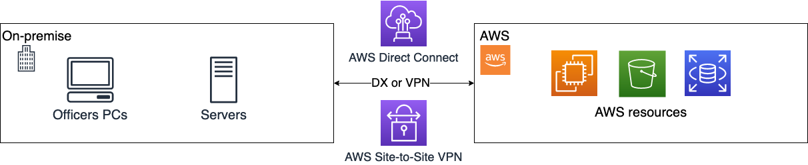
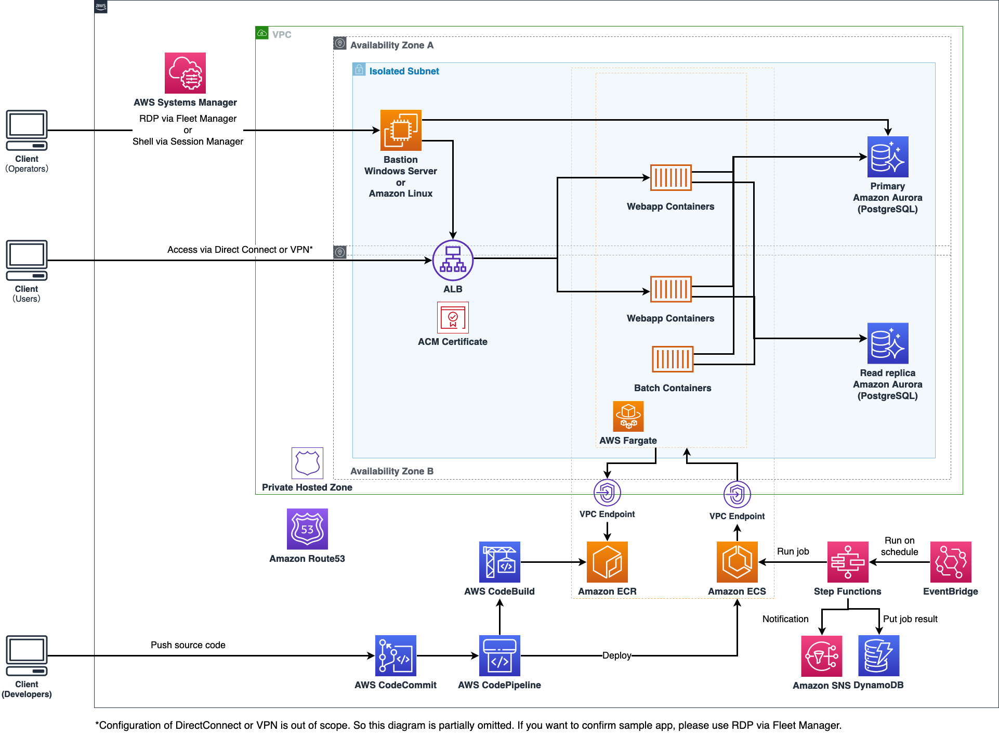
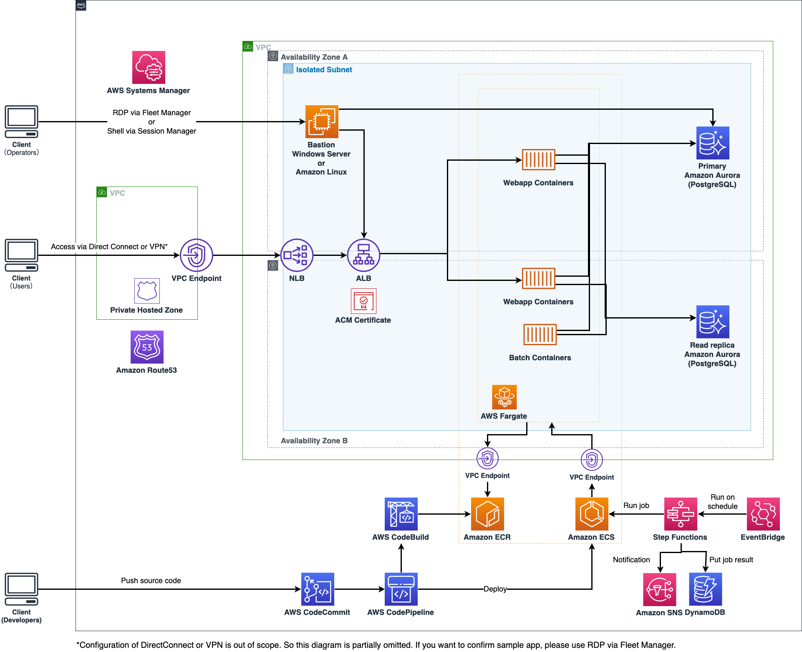

# Template for Closed Network System Workloads on AWS

[日本語で読む](./README_ja.md)

It assumes a closed network scenario and is a template for deploying applications and batch systems accessible from that environment to AWS.
It consists of AWS CDK and Web server sample applications that via CI/CD (AWS CodePipelie) will be deployed to private networks.

In local government systems that require a high level security and network restrictions, we need to configure our architecture with characteristics from on-premise, like "Closed area networks" and "Allow NW access routes from AWS to on-premise network". We designed the template so that these type of systems can be deployed on AWS.

We will adopt REPLATFORM, one of the 6Rs, which is AWS's migration strategy, and aims to migrate from an existing on-premise environment to computing and managed DB using containers. REPLATFORM has advantages such as improving performance and reducing costs. The template uses several AWS managed services that will help us to reduce cost and operational workload.
(Ref：[Migrating to AWS Best Practices and Strategies](https://pages.awscloud.com/rs/112-TZM-766/images/Migrating-to-AWS_Best-Practices-and-Strategies_eBook.pdf)

## Scope

### What the template provides

- Container execution environment for running Java applications (Spring boot) on Amazon ECS/Fargate

  - In addition to this, a sample application using Spring Boot
  - A sample Dockerfile to turn that sample application into a container image
  - For sample applications, see [`Webapp-java/readme.md`](./webapp-java/README.md)

- CI/CD environment for continuous application development

  - Pipeline for building and deploying the above sample applications using CodePipeline, CodeCommit, and CodeBuild
  - A job execution platform combining Step Functions and Amazon ECS/Fargate that can execute simple job flows

- In addition to this, a Python sample job script

  - A sample Dockerfile for turning the sample job script into a container image
  - For a sample job script, see [`batch/README.md`](./batch/README.md)

- Maintenance environment for checking application operation and managing RDB
  - A secure access where you can test applications and manage databases combining SystemsManager and EC2
  - Provides remote desktop connections (Windows Server Instances) and SSH connections (Amazon Linux Instances)

### What the template doesn't provide

- Settings and implementation on the AWS side involved in on-premise connections such as AWS Direct Connect (DX) and AWS Site-to-Site VPN (VPN)
  - Please design and implement DX and VPN, which are likely to be necessary for actual use on the user's side
- Application authentication function
  - Since this application is a sample, it does not have authentication or authorization functions such as login/logout
- DNS settings for applications
  - To check the operation of this template, we will use an endpoint that AWS automatically creates for the ALB
- Operation features
  - It does not have integrated management of application and AWS resource logs or the ability to alert and monitor applications

## Directories

This is the directory tree and its overview.

| Directory   | Sub directory  | Description                                                                                                                                                                                                                                                                                     |
| ----------- | -------------- | ----------------------------------------------------------------------------------------------------------------------------------------------------------------------------------------------------------------------------------------------------------------------------------------------- |
| batch       |                | Creates a batch container application with Dockerfile                                                                                                                                                                                                                                           |
|             | src            | python scripts sample app                                                                                                                                                                                                                                                                       |
| infra       |                | CDK source code for provisioning the following AWS resources  - Network (VPC and subnet)  - DB (Aurora)  - Compute resources for containers (Amazon ECS, Fargate)  - CI/CD tools (CodePipeline, CodeCommit, CodeDeploy)  - Batch Job Management ( Step Functions, DynamoDB, SNS) |
|             | bin            | CDK app source code                                                                                                                                                                                                                                                                             |
|             | lib/constructs | Constructs used to build AWS resources   The [Core concept](https://docs.aws.amazon.com/ja_jp/cdk/v2/guide/core_concepts.html) explains about what is the difference between Stack and Construct.                                                                                            |
| webapp-java |                | Source code of SpringBoot web app with Dockerfile                                                                                                                                                                                                                                               |

## Requirement

- `Node.js` >= `16.13.0`
- `npm` >= `9.2.0`
- `aws-cdk` >= `2.65.0`
- `aws-cdk-lib` >= `2.65.0`
- `OpenSSL` >= `3.0.8`

## Architecture

### NW configuration assumptions

It is assumed that the on-premise NW (on the right side of the image bellow) exists and the AWS network will be connected via Direct Connect or VPN.

### Architecture diagram

This template will deploy AWS resources in the application NW connected by AWS Direct Connect (DX) or AWS Site-to-Site VPN (VPN).

Is important to mention that in addition to configuring NW routes on DX and VPNs, please have a look at using private links for better network desing in this blog post: [an AWS Transit Gateway that can also be used with a “shared” AWS DirectConnect](https://aws.amazon.com/jp/blogs/news/aws-transit-gateway-with-shared-directconnect/).

### Using Private Link

The template, optionally allows you to provision the architecture by using Private Links. It is recommended for an extra layer of security when designing applications that are deployed in Private networks.

This is the architecture diagram that is slightly modified by using private links for the services:

## How to Deploy

Please see the following document: [infra/README.md](./infra/README.md)

## Security

See [CONTRIBUTING](CONTRIBUTING.md#Security-issue-notifications) for more information.

## License

This library is licensed under the MIT-0 License. See the LICENSE file.
