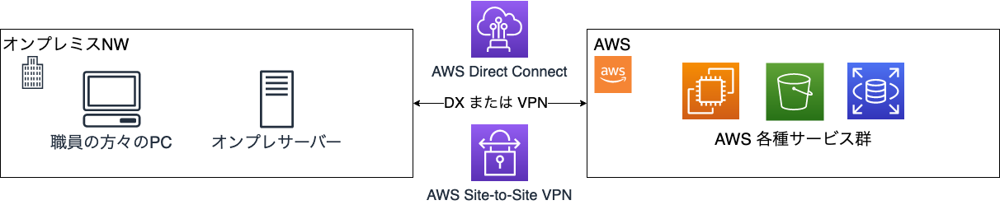

# Template for Closed Network System Workloads on AWS

[View this page in English](./README.md)

閉域網を前提環境とし、その環境からアクセス可能な Web アプリケーションとバッチシステムを AWS 上に展開するためのテンプレートとなります。
CDK で構築されるインフラ とサンプルアプリのソースコードで構成されています。

地方自治体のようなシステムがデプロイされている環境の特性である、「閉域網」や「AWS からオンプレへの NW アクセス経路の確保」を考慮した上で、
AWS のマイグレーション戦略である 6R の一つ、REPLATFORM を採用し、既存のオンプレ環境から、コンテナを利用したコンピューティングやマネージドな DB への移行を目指します。
(ご参考：[AWS への移行:ベストプラクティスと戦略](https://pages.awscloud.com/rs/112-TZM-766/images/Migrating-to-AWS_Best-Practices-and-Strategies_eBook.pdf)
)
REPLATFORM では、サーバの運用負荷の軽減などがメリットになります。本テンプレートでも、AWS のマネージドサービスを活用した形で運用コストの軽減を目指しました。

また、Container の代わりに、AWS Lambda を利用して API を構築し、React アプリケーションを利用した、サーバーレスアプリケーション版を追加しました。
デプロイ方法については、[こちら](./infra/README_serverless_ja.md)を参照ください。

## テンプレートのスコープ

### テンプレートで提供されるもの

- Java アプリケーション(Spring boot)を Amazon ECS/Fargate 上で稼働させるためのコンテナ実行環境(\*)
  - これに加え、上記環境下で動作する Spring boot を利用したサンプルアプリケーション
  - そのサンプルアプリケーションをコンテナイメージにするためのサンプル Dockerfile
    - サンプルアプリケーションについては、[`webapp-java/README.md`](./usecases/webapp-java/README_ja.md)をご参照ください
- 閉域網で SPA ＋ REST API を動かすための、Amazon S3、Amazon API Gateway、AWS Lambda を利用したサーバーレスな実行環境(\*)
  - React のサンプルアプリケーション
    - 詳しくは、[`Webapp-react/readme_ja.md`](./usecase/webapp-react/README_ja.md)を参照ください
  - React サンプルアプリケーションから呼び出される REST API のサンプルコード
- アプリケーションを継続開発するための CI/CD 環境
  - AWS CodePipeline や AWS CodeCommit, AWS CodeBuild を利用した、上記サンプルアプリケーションをビルド、デプロイするためのパイプライン
- 簡易なジョブフローが実行できる、AWS Step Functions、Amazon ECS/Fargate を組み合わせたジョブ実行基盤
  - これに加え、上記環境下で動作する、Python のサンプルジョブスクリプト
  - サンプルジョブスクリプトをコンテナイメージにするためのサンプル Dockerfile
- アプリケーションの動作確認や RDB を管理するためのメンテナンス環境
  - SystemsManager と EC2 を組み合わせたアプリケーションのテストや DB の管理を実施できる環境
  - リモートデスクトップ接続（Windows Server Instance）と コンソール接続（Amazon Linux Instance）を提供

\* コンテナ実行環境とサーバーレスな実行環境は、どちらか選んでデプロイしていただく手順をそれぞれの README に記載しています。

### テンプレートで提供されないもの

- AWS Direct Connect(DX)や AWS Site-to-Site VPN(VPN) といったオンプレとの接続に関わる AWS 側の設定や実装
  - 本番利用において必要になると思われる DX や VPN の設計・導入については、別途実施ください
- アプリケーションの認証機能
  - 本アプリケーションはサンプルのため、ログイン・ログアウトなどの認証機能を持ちません
- アプリケーションの運用機能
  - アプリケーションや AWS リソースのログの統合的な管理やアプリケーションに対するアラートや監視の機能は持ちません

## ディレクトリ構成

ディレクトリ構成とその概要です。

| ディレクトリ | サブディレクトリ | 概要                                                                                                                                                                                                                                                                                                                         |
| ------------ | ---------------- | ---------------------------------------------------------------------------------------------------------------------------------------------------------------------------------------------------------------------------------------------------------------------------------------------------------------------------- |
| docs         |                  | プロジェクト全体のドキュメントと画像ファイル                                                                                                                                                                                                                                                                                 |
|              | images           | アーキテクチャ図、スクリーンショット等の画像ファイル                                                                                                                                                                                                                                                                         |
| usecases     |                  | 各ユースケース別のプロジェクトディレクトリ                                                                                                                                                                                                                                                                                   |
|              | webapp-java      | Spring Boot製のWebアプリケーションとバッチシステムのサンプル ECS/Fargateを使用したコンテナ実行環境、Aurora PostgreSQL、CI/CDパイプライン、バッチジョブ管理を提供 詳細は[`usecases/webapp-java/README_ja.md`](./usecases/webapp-java/README_ja.md)を参照                                                              |
|              | webapp-react     | React製のWebアプリケーションとサーバーレス環境のサンプル ECS/FargateまたはサーバーレスでのReactアプリケーション実行環境を提供 詳細は[`usecases/webapp-react/README_ja.md`](./usecases/webapp-react/README_ja.md)を参照                                                                                                |
|              | infraops-console | クローズドネットワーク環境でのAWSリソース管理コンソール Remix製のWebアプリケーションでEC2、ECS、RDSリソースを統合管理、ABAC（属性ベースアクセス制御）を実装 詳細は[`usecases/infraops-console/README.md`](./usecases/infraops-console/README.md)を参照                                                              |

## 前提条件

- `Node.js` >= `22.0.0`
- `npm` >= `9.2.0`
- `aws-cdk` >= `2.1022.0`
- `aws-cdk-lib` >= `2.206.0`
- `TypeScript` >= `5.6.0`
- `OpenSSL` >= `3.0.8`
- `Docker`

## アーキテクチャ

### NW 構成の前提

オンプレミス NW と AWS とは、Direct Connect または、VPN で接続されることを前提としています。

### Private Link を利用する場合

また、前述の構成において、既存 NW との CIDR 重複を回避するために、Private Link の利用を検討するケースもあるかと思います。Private Link を利用する場合には、[“共有型”AWS DirectConnect でも使える AWS Transit Gateway](https://aws.amazon.com/jp/blogs/news/aws-transit-gateway-with-shared-directconnect/)を参照いただき、最適な NW 設計をご検討ください。

## Security

See [CONTRIBUTING](CONTRIBUTING.md#Security-issue-notifications) for more information.

## License

This library is licensed under the MIT-0 License. See the LICENSE file.
