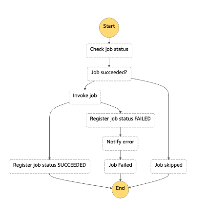

# Infra

[日本語で読む](./README_ja.md)

This is the CDK code to deploy application on a closed/private network built on AWS.

## Preparation

### 1. Configuring the AWS CLI

In order to use the CDK and deploy this application it is necessary to configure the `AWS CLI`. On a terminal run the following command:

```bash
$ aws configure --profile {profile name}
```

Run and enter the required information in response to the prompts that appear.

The access key, secret key, and default region that are displayed when an IAM user is created are checked.
For more information, see [Quick Setup with aws configure - Profiles](https://docs.aws.amazon.com/cli/latest/userguide/cli-configure-quickstart.html#cli-configure-quickstart-profiles).

### 2. Rewrite stages.js

This template is using Task Runner [gulp](https://gulpjs.com/) for deployment.
The variables referred to from gulp are defined in `stages.js`, so they can be changed according to each environment.

```javascript
default: {
    appName,
    awsProfile: 'myProfile',
    alias: 'default',
    deployEnv: 'dev',
    notifyEmail: 'default-mail@default-mail.com',
    enabledPrivateLink: false,
    windowsBastion: true,
    linuxBastion: true,
    domainName: 'templateapp.local',
},
alias: {
    appName: '',          // application's name ex: demoapp
    awsProfile: '',       // aws profile that you configured in step 1
    alias: '',            // identifier to deploy to same aws account by other teammates. ex: ysuzuki
    deployEnv: ''         // deploy stage ex: dev, stage, prod
    notifyEmail: '',      // This e-mail to send message when job was failed.
    enabledPrivateLink: , // Whether using PrivateLink or not. true is using PrivateLink, and false is not.
    windowsBastion: true, // Whether using Windows Bastion instance or not. true is using it, and false is not.
    linuxBastion: true,   // Whether using Amazon Linux Bastion instance or not. true is using it, and false is not.
    domainName: 'templateapp.local', // It will be registered to Private Hosted Zone.
}
```

### 3. Create self-signed certificate

Self-signed certificate will be used in this sample to use HTTPS.
Please run this command to import certificate to Amazon Certificate Manager in `infra` dir.
Please install `OpenSSL` to your local environment befeore running these commands.

```bash
$ npm install
$ npm run create-certificate -- --{alias}
```

## How to deploy

### 1. CDK

Run the following command to deploy in `infra` dir:

```bash
$ npm run deploy -- --{alias}
```

After deployment, the comannds to get keypairs will be shown in same terminal.
If you want to use ssh from your client or RDP connection via FleetManager, please get keypairs by commands like below.

(Correct keypair ID will be included in fact.)

1. The case of Windows instance in ap-northeast-1 region.

```
{alias}{stage}{appName}Webapp.WindowsGetSSHKeyForWindowsInstanceCommand = aws ssm get-parameter --name /ec2/keypair/key-XXXXXXXXXXXXXXXXX --region ap-northeast-1 --with-decryption --query Parameter.Value --output text
```

2. The case of Amazon Linux instance in ap-northeast-1 region.

```
{alias}{stage}{appName}Webapp.LinuxGetSSHKeyForLinuxInstanceCommand = aws ssm get-parameter --name /ec2/keypair/key-XXXXXXXXXXXXXXXXX --region ap-northeast-1 --with-decryption --query Parameter.Value --output text
```

And mail adderess you put in `stages.js` will receive email from Amazon SNS after CDK deployment.
Please do confirmation of this email follow these steps in email to receive notification of job failed.
And job will be start at 21:00 JST on weekdays. The initial data sets registered by deployment of sample web application is set so that all jobs succeed. So no notification is sent.
If you want to confirm the failure notification, please change any of the `true` values of `webapp-java/src/main/resources/data.sql` to `false` and then deploy the web application.

### 2. Deploy sample web application via pipeline

Your source code repository was created after deploying CDK.
You can deploy sample web application via pipeline by following steps to push source code to your repository.

```bash
$ cd ./webapp-java
$ git init
$ git remote add origin https://git-codecommit.{your region}.amazonaws.com/v1/repos/{your repository name}
$ git add *
$ git commit -m "Initial commit"
$ git push --set-upstream origin main
$ git checkout -b develop
$ git push --set-upstream origin develop
```

\* When the develop branch was changed, this pipeline will be invoked. So, you have to create develop branch.

If you want to confirm pipeline situation, please access AWS CodePipeline via management console.

#### CI/CD Pipeline

The implementation of this CI/CD is based on the BlackBelt sample: [(Black Belt AWS - Page 52)](https://d1.awsstatic.com/webinars/jp/pdf/services/20201111_BlackBelt_AWS%20CodeStar_AWS_CodePipeline.pdf?page=52)

If you want to replace it with your own web application or job script, replace the source code you push to CodeCommit with your own and modify the Dockerfile to suit your environment and application.

### 4. Delete environment

If you want to delete the created environment, execute the following command:

```
npm run destroy -- --{alias}
```

Some resources that like a ECR may remain due to the status. So you may need to delete them manually.
Ref：[(ecr): add option to auto delete images upon ECR repository removal #12618 ](https://github.com/aws/aws-cdk/issues/12618)
If destroy command was failed, please check the error message or CloudFormation console to understand what happend and root cause of errors to solve them.

### Additional commands

Since `diff, list`, which is the CDK command, has already been implemented in gulp, these commands can also be executed via gulp.

```
npm run diff -- --{alias}
npm run list -- --{alias}
```

## Job management feature implemented by Step Functions

A job management feature requires functions such as:

- 1. Create a workflow
- 2. Re-run job script
- 3. Sending a notification when job script fails

As for the first function ① Create a workflow, it is possible to achieve it with AWS Step Functions, but we need to implement functions ② and ③.

In this sample, we provide examples of these ② and ③.

AWS Step Functions state machine has a parent-child relationship, and the parent side realizes the main workflow, and ② and ③ are realized on the child side.

For information on how to create a workflow in a state machine, please see [official documentation](https://docs.aws.amazon.com/step-functions/latest/dg/welcome.html).

Here, we will explain about ② and ③.
The following figure shows a child state machine called from the parent state machine.



In the child state machine, a certain job script is executed and it is executed according to the following flow.

1. Check the execution status of the job script for the day
2. Determine if the job was successful
3. If successful, the job will be skipped and child statemachine will be ended
4. If it's not successful, run the job script
5. If the result of the job script is successful, the execution state is registered as "SUCCEEDED" and this state machine is ended
6. If the result of the job script fails, register the execution state as "FAILED"
7. Continue and notify by email about the failure
8. Set failed as a state machine and exit

When the status is checked or the status is registered, AWS DynamoDB is used, and the execution state of the job is checked and registered using the execution date and job ID as keys.
By managing the execution state in this way, it is possible to re-execute the job(②).

As for the job failure notification(③), when AWS Step Functions executes the AWS SNS API, the failed job ID is passed to AWS SNS and a notification is sent to the subscribed email address.

## Best practices checking for CDK

The CDK code of this project uses [cdk-nag](https://github.com/cdklabs/cdk-nag/blob/main/README.md) to check for best practices agains rule packs.

Fatal security risks are prevented by checking whether implementation has been made in accordance with the CDK-NAG rules.

The rules that have been excluded are described together at the bottom of the source code. Please add or remove exceptions as needed.

For specific usage, see [Manage application security and compliance with the AWS Cloud Development Kit and cdk-nag](https://aws.amazon.com/jp/blogs/news/manage-application-security-and-compliance-with-the-aws-cloud-development-kit-and-cdk-nag/).

## How to solve the checks of Security Hub

When Security Hub is enable, two policies will be enable by default.

- [AWS Foundational Security Best Practices (FSBP) standard](https://docs.aws.amazon.com/securityhub/latest/userguide/fsbp-standard.html)
- [Center for Internet Security (CIS) AWS Foundations Benchmark v1.2.0](https://docs.aws.amazon.com/ja_jp/securityhub/latest/userguide/cis-aws-foundations-benchmark.html)

These checks may show the detection of CRITICAL and HIGH severity by Security Hub.

### Enable MFA for the root user

#### Checks

- [[CIS.1.13] Ensure MFA is enabled for the "root" account](https://docs.aws.amazon.com/securityhub/latest/userguide/securityhub-cis-controls.html#securityhub-cis-controls-1.13)
- [[CIS.1.14] Ensure hardware MFA is enabled for the "root" account](https://docs.aws.amazon.com/securityhub/latest/userguide/securityhub-cis-controls.html#securityhub-cis-controls-1.14)
- [[IAM.6] Hardware MFA should be enabled for the root user](https://docs.aws.amazon.com/securityhub/latest/userguide/securityhub-standards-fsbp-controls.html#fsbp-iam-6)

#### How to fix

- Access the management console as root user and follow below document.
  - [Enable a hardware TOTP token for the AWS account root user (console)](https://docs.aws.amazon.com/IAM/latest/UserGuide/id_credentials_mfa_enable_physical.html#enable-hw-mfa-for-root)

### Disable CodeBuild's privileged mode

#### Checks

- [[CodeBuild.5] CodeBuild project environments should not have privileged mode enabled](https://docs.aws.amazon.com/securityhub/latest/userguide/securityhub-standards-fsbp-controls.html#fsbp-codebuild-5)

#### How to fix

- CodeBuild's priviledge mode should be disable except when docker image build is required.
- In this template, priviledge mode is enable because pipeline build a docker image.
- Please check your enviornment and requirements and fix this configuration.
  - If you want to fix template's configuration, [please change the priviledge parameter of CodePipeline's construct](lib/constructs/codepipeline/codepipeline.ts#L65) to `false`
  - Refer:[interface BuildEnvironment - privileged](https://docs.aws.amazon.com/cdk/api/v1/docs/@aws-cdk_aws-codebuild.BuildEnvironment.html#privileged)

## Path to production

### Security updates to EC2

If you're using an EC2 instance for operational management, consider how to apply security updates.

It is also possible to apply package updates manually via Session Manager, but Patch Manager is useful to do this automatically. For more information, see [AWS Systems Manager Patch Manager](https://docs.aws.amazon.com/ja_jp/systems-manager/latest/userguide/systems-manager-patch.html) and [AWS Well-Architected Framework](https://docs.aws.amazon.com/ja_jp/wellarchitected/latest/framework/welcome.html).

### Container image tags

The CI/CD Pipeline will attach the tag of commit hash version to Web app container image when you push the new code to CodeCommit repository.
If you want to manage batch container like a webapp container, please implement pipeline for batch container image based on the CI/CD pipeline of webapp.

### Self-signed certificate

This sample uses self-signed certificate to enable HTTPS.
Since it's a self-signed certificate, please use it only for test/develop environment. Also, while accessing the webapp, you will notifice the security warning in your browser, you will have to accept it to access the application or deploy the CDK application with a signed certificate.
