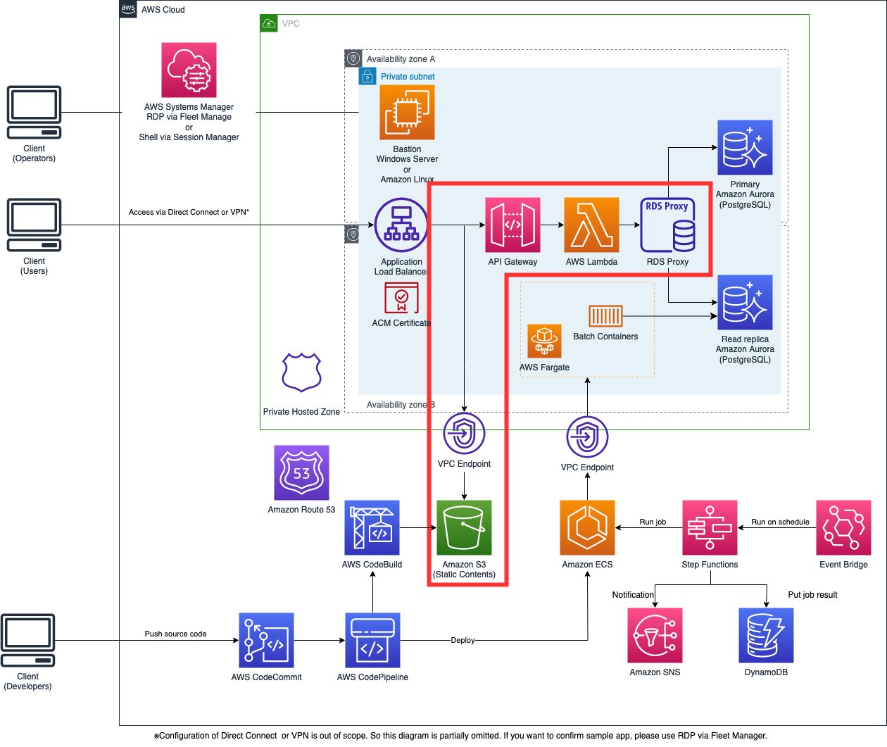
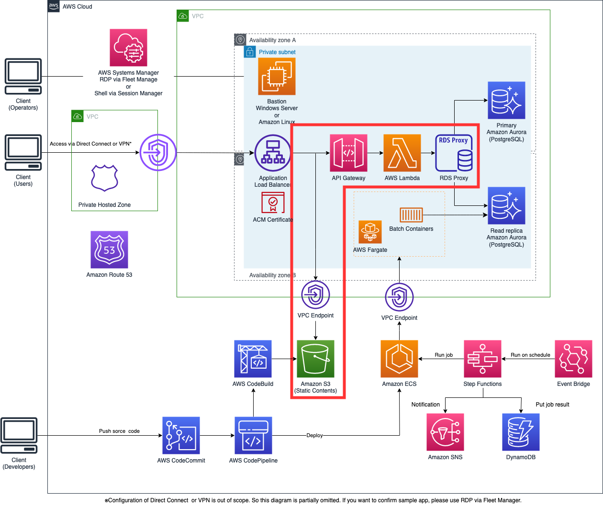
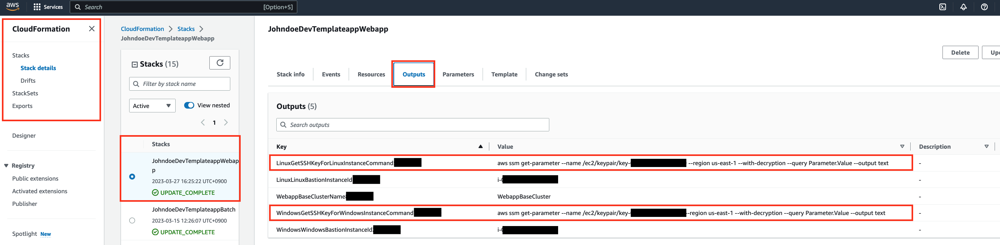
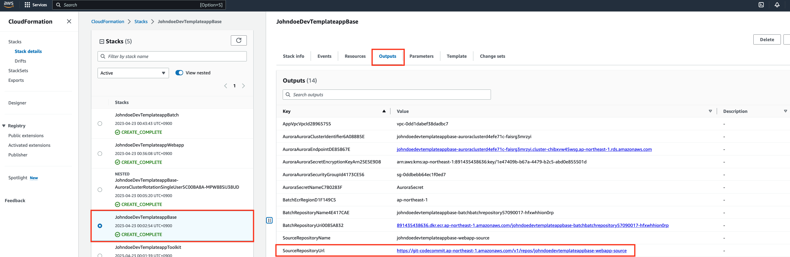

# Serverless application version

This is CDK code to build an environment to run serverless sample applications and batch systems on AWS.

## Overview

If the number of accesses is low or there is a time period where there is almost no access, running servers all the time using ECS/Fargate costs a lot compared to the actual usage amount. There are also operating costs for container images.

In such cases, reduce costs and operational troubles by using serverless by S3 and Lambda.

Hosting an internal HTTPS static website using ALB, S3, and PrivateLink in a closed network is described in [this blog](https://aws.amazon.com/jp/blogs/networking-and-content-delivery/hosting-internal-https-static-websites-with-alb-s3-and-privatelink/).
This template includes architecture of this blog.
By using this source code, you can automate complicated Internal ALB settings, etc.

The architecture diagram is as follows. (The area circled red is the difference from the container version)



When using Private Link, it looks like this:


## Preparation
### 1. Configuring the AWS CLI

In order to use the CDK and deploy this application it is necessary to configure the `AWS CLI`. On a terminal run the following command:

```bash
$ aws configure --profile {profile name}
```

Run and enter the required information in response to the prompts that appear.

The access key, secret key, and default region that are displayed when an IAM user is created are checked.
For more information, see [Quick Setup with aws configure - Profiles](https://docs.aws.amazon.com/cli/latest/userguide/cli-configure-quickstart.html#cli-configure-quickstart-profiles).

### 2. Rewrite stages.js

This template is using Task Runner [gulp](https://gulpjs.com/) for deployment.
The variables referred to from gulp are defined in `stages.js`, so they can be changed according to each environment.

```javascript
default: {
    appName,
    awsProfile: 'myProfile',
    alias: 'default',
    deployEnv: 'dev',
    notifyEmail: 'default-mail@default-mail.com',
    enabledPrivateLink: false,
    windowsBastion: true,
    linuxBastion: true,
    domainName: 'templateapp.local',
},
alias: {
    appName: '',          // application's name ex: demoapp
    awsProfile: '',       // aws profile that you configured in step 1
    alias: '',            // identifier to deploy to same aws account by other teammates. ex: ysuzuki
    deployEnv: ''         // deploy stage ex: dev, stage, prod
    notifyEmail: '',      // This e-mail to send message when job was failed.
    enabledPrivateLink: , // Whether using PrivateLink or not. true is using PrivateLink, and false is not.
    windowsBastion: true, // Whether using Windows Bastion instance or not. true is using it, and false is not.
    linuxBastion: true,   // Whether using Amazon Linux Bastion instance or not. true is using it, and false is not.
    domainName: 'templateapp.local', // It will be registered to Private Hosted Zone.
}
```

### 3. Create self-signed certificate

Self-signed certificate will be used in this sample to use HTTPS.
Please run this command to import certificate to Amazon Certificate Manager in `infra` dir.
Please install `OpenSSL` to your local environment befeore running these commands.

```bash
$ npm install
$ npm run create-certificate -- --{alias}
```

## How to deploy

### 1. CDK

After deployment, the comannds to get keypairs will be shown in same terminal.
If you want to use ssh from your client or RDP connection via FleetManager, please get keypairs by commands like below.

(Correct keypair ID will be included in fact.)

1. The case of Windows instance in ap-northeast-1 region.

```
{alias}{stage}{appName}Webapp.WindowsGetSSHKeyForWindowsInstanceCommand = aws ssm get-parameter --name /ec2/keypair/key-XXXXXXXXXXXXXXXXX --region ap-northeast-1 --with-decryption --query Parameter.Value --output text
```

2. The case of Amazon Linux instance in ap-northeast-1 region.

```
{alias}{stage}{appName}Webapp.LinuxGetSSHKeyForLinuxInstanceCommand = aws ssm get-parameter --name /ec2/keypair/key-XXXXXXXXXXXXXXXXX --region ap-northeast-1 --with-decryption --query Parameter.Value --output text
```

> NOTE:
> If you deploy this template at first, there are many outputs in your terminal.
> So, you may not find these commands in your terminal.
> In this case, please go to CloudFormation's console in your browser.
> And open the `Output` tab of `Webapp stack`. You can see commands in your screen like below image.
> 

And mail adderess you put in `stages.js` will receive email from Amazon SNS after CDK deployment.
Please do confirmation of this email follow these steps in email to receive notification of job failed.
And job will be start at 21:00 JST on weekdays. The initial data sets registered by deployment of sample web application is set so that all jobs succeed. So no notification is sent.
If you want to confirm the failure notification, please change one of the 5 `trues` to `false` in the sample web application that will be deployed later.

### 2. Sample web apps

Your source code repository was created after deploying CDK.

> NOTE:
> Your source code repository URL will be shown in your console after deploying CDK or in CloudFormation Console of AWS Management Console like below.
> 

Set `REACT_APP_ENDPOINT_URL` defined in the `.env` file in the `webapp-react` directory as `https://app.{domainName}/apigw/` ( use `domainName` in `stages.js`.)

You can deploy sample web application via pipeline by following steps to push source code to your repository.

```bash
$ cd./webapp-react
$ git init
$ git remote add origin https://git-codecommit.{your region}.amazonaws.com/v1/repos/{your repository name}
$ git add.
$ git commit -m "Initial commit"
$ git push --set-upstream origin main
$ git checkout -b develop
$ git push --set-upstream origin develop
```

> NOTE:
> When the develop branch was changed, this pipeline will be invoked. So, you have to create develop branch.

If you want to confirm pipeline situation, please access AWS CodePipeline via management console.


#### CI/CD Pipeline

The implementation of this CI/CD is based on the BlackBelt sample: [(Black Belt AWS - Page 52)](https://d1.awsstatic.com/webinars/jp/pdf/services/20201111_BlackBelt_AWS%20CodeStar_AWS_CodePipeline.pdf?page=52)

If you want to replace it with your own web application or job script, replace the source code you push to CodeCommit with your own and modify the Dockerfile to suit your environment and application.

### ３. Testing

When you want to check web application, you can access the app through the Bastion server on EC2.
To access to the Bastion server via Fleet Manager Remote Desktop, you use the keypair that you've gotten in section [1. CDK].
If you want to know about how to access the Bastion server via Fleet Manager Remote Desktop, please see [Connect to a managed node using Remote Desktop](https://docs.aws.amazon.com/systems-manager/latest/userguide/fleet-rdp.html#fleet-rdp-connect-to-node).

If you can access to Bastion server, open your browser and enter the domain specified by `app.{domainName}` in `stages.js` to access the web application.

If the following screen is displayed, it is successful.


### 4. Delete environment

If you want to delete the created environment, execute the following command:


```
$ npm run destroy-serverless -- --{alias}
```

Some resources that like a ECR may remain due to the status. So you may need to delete them manually.
Ref：[(ecr): add option to auto delete images upon ECR repository removal #12618 ](https://github.com/aws/aws-cdk/issues/12618)
If destroy command was failed, please check the error message or CloudFormation console to understand what happend and root cause of errors to solve them.


### Additional commands

Since `diff, list`, which is the CDK command, has already been implemented in gulp, these commands can also be executed via gulp.

```
$ npm run diff-serverless -- --{alias}
$ npm run list-serverless -- --{alias}
```

## Considerations in production

### S3 bucket names

In order to communicate, the S3 bucket name must match the website domain name.
S3 bucket names must be unique across all AWS accounts, and this limitation may prevent you from deploying a website with your preferred domain name.

### Migration steps from the container version

If you are using the container version and are thinking about moving to serverless, you need to follow the following steps.

- Get the latest source code from GitHub, including the serverless version
- `npm run destroy-webapp -- --{alias}` command to delete the deployed Webapp stack
- The certificate has been created, so Implement the deployment according to the　”1. CDK” after `npm install` in function folder
- Since Java application code has been deployed in the existing CodeCommit repository for webapps, delete only the source code while leaving git related files in the webapp-java directory, and copy the webapp-react source code to the webapp-java directory.
- Next, rename the webapp-java directory to webapp-react
- change `.env` by domain name in `stages.js`
- Run the following command to push the react source code

```
$ cd webapp-react
$ git add.
$ git commit -m "Initial commit"
$ git push
```
