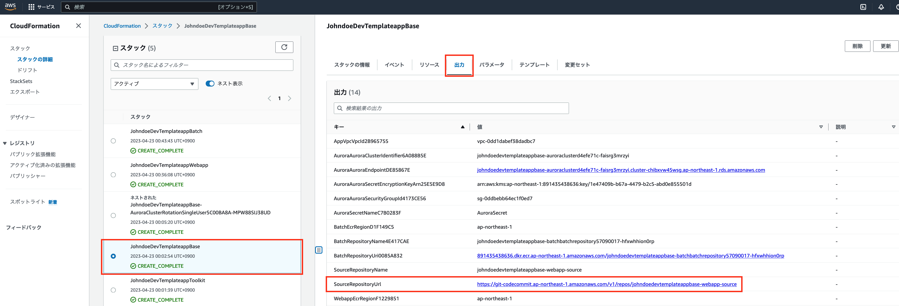

# サーバーレスアプリケーション版

AWS 上にサーバーレスなサンプルアプリケーションやバッチシステムを動かす環境を構築する CDK のコードです。

## 概要

アクセス数が少ない、またはほとんどアクセスしない時間帯があるようなアプリケーションを、ECS/Fargate を用いて常時稼働しておくと、実際の利用量に対し、費用がかかります。また、コンテナイメージなどの運用コストもあります。

そのような場合に、ウェブサイト部分を S3 や Lambda を用いてサーバーレスで構成することによって、費用や運用の手間を減らすことができます。

閉域網における ALB、S3、PrivateLink による内部 HTTPS 静的 Web サイトのホスティングは、[こちらのブログ](https://aws.amazon.com/jp/blogs/news/hosting-internal-https-static-websites-with-alb-s3-and-privatelink/)に記載されており、このブログをもとに CDK 化したものが、サーバーレス版の本ソースコード群の一部となります。本ソースコードをご利用いただくことで、煩雑な Internal ALB の設定などを自動化することができます。

構成図は以下のとおりです。（赤枠で囲ったところがコンテナ版との差分です）


Private Link を用いた場合、以下の通りになります。


### 1. AWS CLI の設定

CDK を利用するため、コマンドを実行する端末で AWS の設定が必要になります。

```bash
$ aws configure --profile {プロファイル名}
```

と実行し、表示されるプロンプトに応じて、必要な情報を入力してください。

IAM ユーザ作成時に表示される、アクセスキーとシークレットキー、デフォルトのリージョンが確認されます。
詳しくは[aws configure を使用したクイック設定 - プロファイル](https://docs.aws.amazon.com/ja_jp/cli/latest/userguide/cli-configure-quickstart.html#cli-configure-quickstart-profiles)をご参照ください。

### 2. stages.js の書き換え

本テンプレートは、タスクランナーの[gulp](https://gulpjs.com/)を利用してデプロイを行います。
gulp から参照される変数が`stages.js`で定義されているため、各自の環境に合わせて変更します。

```javascript
default: {
    appName,
    awsProfile: 'myProfile',
    alias: 'default',
    deployEnv: 'dev',
    notifyEmail: 'johndoe@johndoe.mail.com',
    enabledPrivateLink: false,
    windowsBastion: true,
    linuxBastion: true,
    domainName: 'templateapp.local',
  },
alias: {
    appName: '',               // アプリの名前を入力します。 例: demoapp, など
    awsProfile: '',            // 1で設定したProfile名を入力します。
    alias: '',                 // 個々人で環境面が被るのを回避するため、ユーザ名などの識別子を入力してください。 例: ysuzuki, など
    deployEnv: ''              // デプロイする環境の面を記載します。例: dev, stage, prod, など
    notifyEmail: '',           // ジョブが失敗した際の通知先メールアドレス
    enabledPrivateLink: false, // PrivateLinkを利用するかどうか。trueは利用し、falseは利用しない
    windowsBastion: true,      // WindowsのBastionインスタンスを利用する場合はtrue、利用しない場合はfalse
    linuxBastion: true,        // Amazon LinuxのBastionインスタンスを利用する場合はtrue、利用しない場合はfalse
    domainName: '', // Private Hosted Zoneに登録されるドメイン名（このドメイン名がS3のバケット名になり、S3 のバケット名はユニークである必要があるため、必ず変更してください。）
}
```

### 3. 自己署名付き証明書の作成

HTTPS 通信を実装するために、今回は自己署名付き証明書を用います。
`infra`ディレクトリで次のコマンドを実行し、Amazon Certificate Manager に証明書をインポートしてください。
また、以下のコマンド実行前に、`OpenSSL`のインストールを実施してください。

```bash
$ npm install
$ npm run create-certificate -- --{alias}
```

### 4. Lambda 関数に必要なモジュールのインストール

`functions`ディレクトリで次のコマンドを実行し、Lambda 関数に必要なモジュールをインストールしてください。

```bash
$ npm install
```

## デプロイ

### 1. CDK

`infra`ディレクトリで以下のコマンドを実行してください。
自動的に CDK が実行され、AWS の各リソースが生成されます。

```bash
$ npm run deploy-serverless -- --{alias}
```

デプロイ後、ターミナル上に以下に示すようなコマンドが出力されますので、コピーして実行してください。
生成された EC2 インスタンス 用の Keypair がそれぞれ取得できます。
コンソール接続する場合や Fleet Manager から RDP 接続する際には、Keypair の取得を行ってください。（コマンド実行時には Profile の指定をお願いします）

```
// regionがap-northeast-1のWindowsインスタンスの場合
$ {alias}{stage}{appName}Webapp.WindowsGetSSHKeyForWindowsInstanceCommand = aws ssm get-parameter --name /ec2/keypair/key-XXXXXXXXXXXXXXXXX --region ap-northeast-1 --with-decryption --query Parameter.Value --output text

// regionがap-northeast-1のAmazonLinuxインスタンスの場合
$ {alias}{stage}{appName}Webapp.LinuxGetSSHKeyForLinuxInstanceCommand = aws ssm get-parameter --name /ec2/keypair/key-XXXXXXXXXXXXXXXXX --region ap-northeast-1 --with-decryption --query Parameter.Value --output text
```

> NOTE:
> 初回デプロイ時は、ターミナルの出力が多いため、Keypair を取得するためのコマンドが見えなくなってしまうことがあります。
> その場合は、ブラウザから CloudFormation のコンソールを開き、Webapp スタックの出力タブからご確認ください。
> 

また、CDK のデプロイが完了すると、`stages.js` に登録したメールアドレス宛に、Amazon SNS よりサブスクリプションの確認メールが届きます。

ジョブが失敗した通知を受けるために、届いたメールの内容に従い、サブスクリプションの Confirmation を実施してください。

また、バッチジョブは平日 21 時に実行される設定になっています。デプロイ時に登録される初期データは、ジョブがすべて成功する設定になっているため、メールは送信されません。
もし、失敗を確認したい場合は、この後デプロイするサンプル Web アプリで、5 つある`true`のいずれかを`false`へ変更してください。

### 2. サンプル Web アプリ

CDK のデプロイが完了したことで、AWS CodeCommit に サンプル Web アプリ用のリポジトリが作成されています。

> NOTE:
> リポジトリの URL はデプロイをしたターミナルもしくは、CloudFormation のコンソールに表示されます。
> CloudFormation のコンソールを参照する場合は、`baseStack`の`出力`タブを参照ください。
> 

`webapp-react` ディレクトリの`.env`ファイルに定義された`REACT_APP_ENDPOINT_URL`を、`stages.js`で設定した`domainName`を使って`https://app.{domainName}/apigw/`に置き換えてください。

その後、以下の手順で、`webapp-react` ディレクトリのソースコードをプッシュすることで、サンプル Web アプリがパイプラインからデプロイされます。

```bash
$ cd ./webapp-react
$ git init
$ git remote add origin https://git-codecommit.{your region}.amazonaws.com/v1/repos/{your repository name}
$ git add .
$ git commit -m "Initial commit"
$ git push --set-upstream origin main
$ git checkout -b develop
$ git push --set-upstream origin develop
```

> NOTE:
> CodePipeline のトリガーは develop ブランチを監視しています。そのため、develop ブランチの作成が必要になります。

パイプラインの状況を確認したい場合は、マネジメントコンソールより AWS CodePipeline へアクセスしてください。

#### CI/CD パイプラインについて

Web アプリ向けの CI/CD は BlackBelt で紹介されている[構成例(Page 52)](https://d1.awsstatic.com/webinars/jp/pdf/services/20201111_BlackBelt_AWS%20CodeStar_AWS_CodePipeline.pdf)を元に実装しています。

ご自身の Web アプリケーションに差し替えたい場合は、CodeCommit にプッシュするソースコードをご自身のものに差し替え、ご自身の環境やアプリケーションに合わせ、Dockerfile を修正してください。

### ３. 動作確認

デプロイした Web アプリの動作を確認したい場合、Bastion として構築した Windows が起動している EC2 上でブラウザを起動し、アプリケーションにアクセスします。

Bastion にアクセスする Keypair は [デプロイ - 1. CDK](#1-cdk) で取得したものを利用し、Fleet Manager 経由でアクセスします。
Fleet Manager を利用した RDP 接続の方法は、[リモートデスクトップを使用してマネージドノードへ接続する](https://docs.aws.amazon.com/ja_jp/systems-manager/latest/userguide/fleet-rdp.html#fleet-rdp-connect-to-node)を参照ください。

Bastion への RDP 接続ができたら、ブラウザを起動し、`stages.js`の`domainName`で指定したドメインを入力し、アプリケーションにアクセスしてください。

次のような画面が表示されたら成功です。


### 4. 作成した環境の削除

生成した環境を削除したい場合は、以下のコマンドを実行してください。
ECR など、状況によっては残ってしまうリソースもあるため、手動での削除が必要な場合があります。
ご参考：[(ecr): add option to auto delete images upon ECR repository removal #12618 ](https://github.com/aws/aws-cdk/issues/12618)
コマンドが失敗した場合は、エラーメッセージや CloudFormation のコンソールで内容をご確認の上、対応ください。

```
$ npm run destroy-serverless -- --{alias}
```

### その他のコマンド

CDK のコマンドである、`diff, list`は、gulp で実装済みのため、これらのコマンドも gulp 経由で実行可能です。

```
$ npm run diff-serverless -- --{alias}
$ npm run list-serverless -- --{alias}
```

## 本番利用時の考慮点

### S3 のバケット名について

通信を疎通させるために、S3 のバケット名をウェブサイトのドメイン名と一致させる必要があります。
S3 のバケット名は全ての AWS アカウント間でユニークである必要があり、この制約により希望のドメイン名でウェブサイトをデプロイできない場合があります。

### コンテナ版からの移行手順

コンテナ版を使っていて、サーバーレスへの移行を考えているときは、大まかには次のような手順を踏む必要があります。

- GitHub からサーバーレス版のソースコードを含んだ、最新のソースコードを取得する
- `npm run destroy-webapp` コマンドを利用し、デプロイ済みの Webapp Stack を削除する
- 証明書の作成は完了しているため、本 README の 1. CDK に従い、デプロイを実施する
- 既存の Webapp 用の CodeCommit リポジトリは、Java アプリケーションコードがデプロイされているため、webapp-java のディレクトリ内の git 関連ファイルを残したまま、ソースコードだけを削除し、webapp-react のソースコードを webapp-java ディレクトリにコピーする。
- 続いて、webapp-java のディレクトリ名を webapp-react に変更する
- 以下のコマンドを実行し、react のソースコードを push する

```
$ cd webapp-react
$ git add .
$ git commit -m "Initial commit"
$ git push --set-upstream origin main
```
