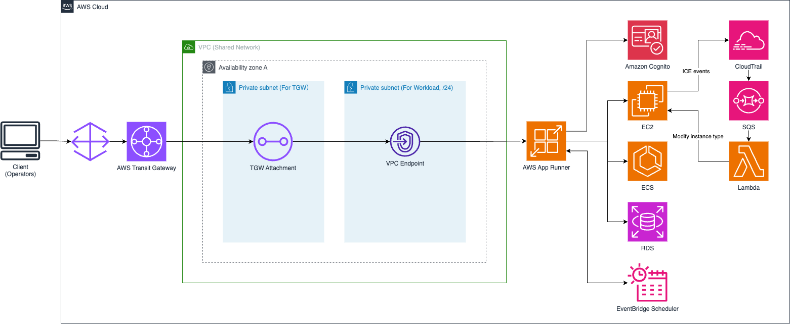

# infraops-console

[日本語で読む](./README_ja.md)

## Overview and Architecture

infraops-console is a web console application for managing AWS resources in closed network environments. It provides integrated operations for EC2 instances, ECS services, and RDS databases, enabling multiple teams within an organization to safely share resources through group-based access control (ABAC).

### System Architecture



### Key Components

- **Remix Web Application**: React/TypeScript-based frontend
- **Amazon Cognito**: User authentication and group management
- **Identity Pool + ABAC**: Attribute-based access control
- **AWS SDK**: EC2, ECS, RDS resource operations
- **EventBridge Scheduler**: Automated start/stop scheduling
- **Lambda Function**: ICE (Insufficient Capacity Error) automatic recovery
- **SQS FIFO Queue**: Event processing reliability

## Prerequisites

### Required AWS Resources

1. **VPC Environment**
   - Private subnets

2. **VPC Endpoints**
   - VPC Endpoint for App Runner

3. **Managed Resources**
   - EC2 instances (tagged with `GroupId`)
   - ECS clusters and services (tagged with `GroupId`)
   - RDS clusters and instances (tagged with `GroupId`)

### Configuration File

Configure the following values in `parameter.ts`:

```typescript
export default {
  deployEnv: 'dev',                              // Deployment environment
  sourceVpcId: 'vpc-xxxxxxxxx',                  // Target VPC ID
  appRunnerVpcEndpointId: 'vpce-xxxxxxxxx'       // App Runner VPC Endpoint ID
};
```

### Required Permissions

The IAM user/role executing the deployment requires the following permissions:
- CDK-related permissions (CloudFormation, IAM, etc.)
- Cognito User Pool/Identity Pool creation permissions
- Lambda, SQS, EventBridge creation permissions
- EC2, ECS, RDS operation permissions

## Security Considerations

### Closed Network Environment

- **No Internet Access**: App Runner service configured with `isPubliclyAccessible: false`
- **VPC Endpoint Communication**: All communications routed through VPC endpoints

> [!IMPORTANT]
> The App Runner service is deployed in public subnets managed by App Runner.
> However, by setting `isPubliclyAccessible: false`, direct access from the internet is
> prevented. It only accepts access from the specified VPC through the VPC Ingress Connection.
> For completely closed network operation, since Amazon Cognito does not support VPC Endpoints,
> it cannot be accessed within a VPC. Therefore, please implement authentication functions
> independently on the application side.
> Alternatively, you can access Cognito via Amazon API Gateway and access the API Gateway through the VPC Endpoint.

### Authentication & Authorization

- **Password Authentication**: Password policies in Cognito
- **Session Management**: Short token validity period (60 minutes)
- **Group-Based Control**: Clear permission separation between administrators and regular users

### Data Protection

- **Principle of Least Privilege**: Fine-grained permission control through IAM policies

## Production Considerations

### Network Access Configuration

#### App Runner VPC Ingress Connection Access Control

By default, the App Runner service is configured to accept connections only from the specified VPC through the VPC Ingress Connection. To allow access from your organization's on-premises networks or other VPC CIDR blocks, you need to configure additional network access.

##### Adding Custom Network Access

To allow access from your organization's IP ranges, you have several options:

**Option 1: VPC Peering or Transit Gateway**
Configure VPC peering or Transit Gateway connections to allow access from other VPCs or on-premises networks to the source VPC.

**Option 2: VPN Connection**
Set up AWS Site-to-Site VPN or AWS Client VPN to provide secure access from on-premises networks.

**Option 3: Direct Connect**
Use AWS Direct Connect for dedicated network connections from on-premises to AWS.

The VPC Ingress Connection is configured in `lib/infraops-console-stack.ts`:

```typescript
new apprunner.VpcIngressConnection(this, 'VpcIngressConnection', {
  vpc: sourceVpc,
  service,
  interfaceVpcEndpoint,
});
```

##### Security Considerations

- The App Runner service is configured with `isPubliclyAccessible: false` for enhanced security
- All access must go through the configured VPC and VPC endpoint
- Ensure proper network segmentation and security group configurations
- Regularly review and audit network access paths
- Consider implementing additional network monitoring and logging

##### Network Architecture Planning

When planning network access for production environments:

1. **Identify Access Requirements**: Determine which networks need access to the console
2. **Choose Appropriate Connectivity**: Select the most suitable connectivity option (VPN, Direct Connect, etc.)
3. **Implement Network Security**: Configure security groups, NACLs, and routing appropriately
4. **Monitor and Audit**: Set up CloudTrail and VPC Flow Logs for network activity monitoring

## Feature List

### EC2 Instance Management

- **Basic Operations**
  - Instance list display
  - Start/stop operations
  - Status monitoring

- **Advanced Features**
  - Alternative instance type configuration
  - ICE (Insufficient Capacity Error) automatic recovery
  - Scheduled start/stop

### ECS Service Management

- **Service Operations**
  - Service list display
  - Desired count modification
  - Service status monitoring

### RDS Database Management

- **Database Operations**
  - Cluster/instance list display
  - Start/stop operations

### Scheduling Features

- **Automation**
  - Cron-based schedule configuration
  - Automated start/stop execution
  - Schedule management (create/delete/update)

### User Management (Administrator Features)

- **User Operations**
  - User creation/deletion
  - Group assignment
  - Permission management

### ICE Automatic Recovery Feature

- **Automatic Recovery**
  - CloudTrail event monitoring
  - Automatic recovery with alternative instance types
  - Reliability through SQS queues

## How to Use

### Deployment Method

1. **Install Dependencies**
   ```bash
   cd usecases/infraops-console
   npm ci
   ```

2. **Parameter Configuration**
   ```bash
   # Edit parameter.ts
   vim parameter.ts
   ```

3. **CDK Deployment**
   ```bash
   # Initial deployment
   npx cdk bootstrap

   # Deploy stack
   npx cdk deploy
   ```

4. **Verify Deployment Completion**
   - Confirm stack creation completion in CloudFormation console
   - Verify user pool creation in Cognito console

### Creating the First User

After deployment completion, execute the command displayed in CloudFormation outputs to create the initial administrator user:

```bash
# Example output (replace with actual values)
aws cognito-idp admin-create-user \
  --user-pool-id us-east-1_xxxxxxxxx \
  --username admin@example.com \
  --user-attributes Name=email,Value=admin@example.com Name=email_verified,Value=true \
  --region us-east-1 && \
aws cognito-idp admin-add-user-to-group \
  --user-pool-id us-east-1_xxxxxxxxx \
  --username admin@example.com \
  --group-name Admins \
  --region us-east-1
```

**Note**: Replace `admin@example.com` and `TempPassword123!` with actual values.

### Usage Instructions

#### Resource Operations

1. **Login**
   - Access the VPC endpoint URL
   - Login through Cognito authentication screen
   - Password change required on first login

2. **EC2 Instance Operations**
   - View instance list on dashboard
   - Execute operations with start/stop buttons
   - Configure alternative types for capacity shortage mitigation

3. **Schedule Configuration**
   - Select instance and display schedule management screen
   - Configure schedules in Cron format
   - Select start/stop actions

4. **ECS/RDS Resources**
   - View resource lists in respective sections
   - Execute operations as needed

#### (For Administrators) Creating Regular Users and Additional Administrator Users

1. **Access User Management Screen**
   - Login as administrator
   - Click "User Management" link in header

2. **Create New User**
   ```
   - Click "Add New User" button
   - Enter email address
   - Set temporary password
   - Select role (Admin/User)
   - Set Group ID (required for regular users)
   - Click "Create" button
   ```

3. **User Type Differences**
   - **Administrator (Admin)**: Access to all resources, user management functionality available
   - **Regular User (User)**: Access only to resources matching their Group ID

4. **Group ID Configuration**
   - Always set Group ID for regular users
   - Must match the `GroupId` tag of managed resources
   - Examples: `team-a`, `project-x`, `dev-environment`

## User Permission Management (Especially ABAC Implementation)

### ABAC (Attribute-Based Access Control) Overview

infraops-console implements access control using the following attributes:

- **User Attributes**: Cognito custom attribute `custom:groupId`
- **Resource Attributes**: AWS resource `GroupId` tags
- **Principal Attributes**: Identity Pool PrincipalTag `GroupId`

### Implementation Architecture

```
┌─────────────────┐    ┌─────────────────┐    ┌─────────────────┐
│ Cognito User    │    │ Identity Pool   │    │ IAM Role        │
│ custom:groupId  │───▶│ PrincipalTag    │───▶│ Policy          │
│ = "team-a"      │    │ GroupId="team-a"│    │ Condition       │
└─────────────────┘    └─────────────────┘    └─────────────────┘
                                                        │
                                                        ▼
                                             ┌─────────────────┐
                                             │ AWS Resource    │
                                             │ Tag:GroupId     │
                                             │ = "team-a"      │
                                             └─────────────────┘
```

### Configuration Steps

#### 1. Cognito User Attribute Configuration

Set `custom:groupId` attribute when creating users:

```bash
aws cognito-idp admin-create-user \
  --user-pool-id us-east-1_xxxxxxxxx \
  --username user@example.com \
  --user-attributes \
    Name=email,Value=user@example.com \
    Name=email_verified,Value=true \
    Name=custom:groupId,Value=team-a \
  --region us-east-1
```

#### 2. Identity Pool PrincipalTag Configuration

Automatically configured in CDK stack:

```typescript
new aws_cognito.CfnIdentityPoolPrincipalTag(this, 'IdentityPoolPrincipalTag', {
  identityPoolId: this.idPool.ref,
  identityProviderName: this.userPool.userPoolProviderName,
  principalTags: {
    'GroupId': 'custom:groupId',  // Map Cognito custom attribute to PrincipalTag
  },
  useDefaults: false
});
```

#### 3. IAM Policy Condition Configuration

Example policy for regular user IAM role:

```json
{
  "Version": "2012-10-17",
  "Statement": [
    {
      "Effect": "Allow",
      "Action": [
        "ec2:StartInstances",
        "ec2:StopInstances"
      ],
      "Resource": "*",
      "Condition": {
        "StringEquals": {
          "ec2:ResourceTag/GroupId": "${aws:PrincipalTag/GroupId}"
        }
      }
    }
  ]
}
```

#### 4. Resource Tag Configuration

Set `GroupId` tags on managed AWS resources:

```bash
# EC2 instance example
aws ec2 create-tags \
  --resources i-1234567890abcdef0 \
  --tags Key=GroupId,Value=team-a \
  --region us-east-1

# ECS service example
aws ecs tag-resource \
  --resource-arn arn:aws:ecs:us-east-1:123456789012:service/cluster-name/service-name \
  --tags key=GroupId,value=team-a \
  --region us-east-1

# RDS cluster example
aws rds add-tags-to-resource \
  --resource-name arn:aws:rds:us-east-1:123456789012:cluster:cluster-name \
  --tags Key=GroupId,Value=team-a \
  --region us-east-1
```

### Access Control Flow

1. **User Login**: Authenticate with Cognito, retrieve `custom:groupId` attribute
2. **Token Exchange**: Set PrincipalTag `GroupId` in Identity Pool
3. **API Call**: Access resources through IAM role
4. **Condition Evaluation**: Compare `${aws:PrincipalTag/GroupId}` with `ResourceTag/GroupId`
5. **Access Grant**: Allow access only when values match

### Administrator Privileges

Administrators have the following privileges:

- **Full Resource Access**: Resource operations without conditions
- **User Management**: Cognito user creation/deletion
- **Group Management**: User group assignment

### Group Management Best Practices

1. **Naming Convention**: Consistent Group ID naming (e.g., `team-{name}`, `project-{name}`)
2. **Least Privilege**: Minimum necessary resource access
3. **Regular Audits**: Periodic review of group assignments
4. **Tag Management**: Consistent resource tag management
5. **Documentation**: Document group-to-resource relationships

### Troubleshooting

#### Access Denied Errors

1. **Check User's Group ID**
   ```bash
   aws cognito-idp admin-get-user \
     --user-pool-id us-east-1_xxxxxxxxx \
     --username user@example.com
   ```

2. **Check Resource Tags**
   ```bash
   aws ec2 describe-instances \
     --instance-ids i-1234567890abcdef0 \
     --query 'Reservations[].Instances[].Tags'
   ```

3. **Check IAM Policy**
   - Review access denied logs in CloudTrail
   - Test condition evaluation with IAM Policy Simulator

This permission management system enables multiple teams within an organization to safely share AWS resources, with each team accessing only their designated resources.
