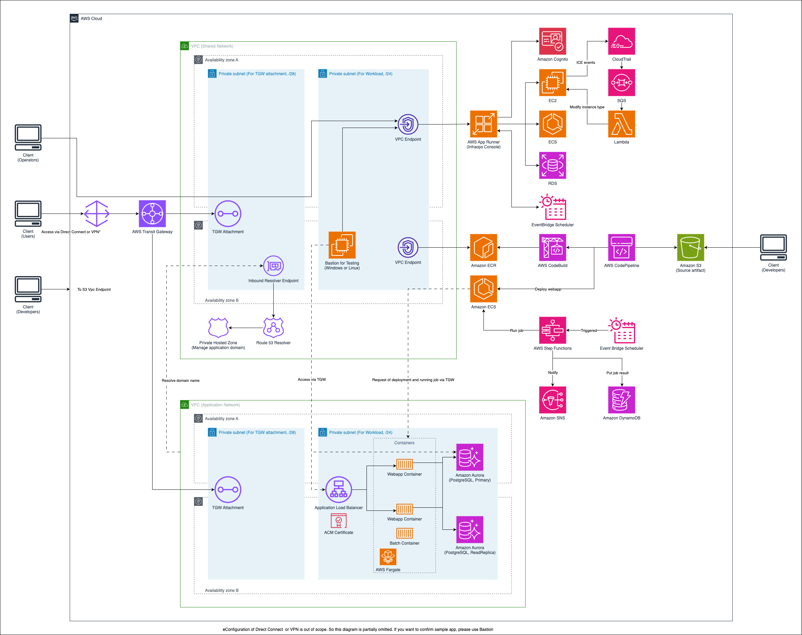
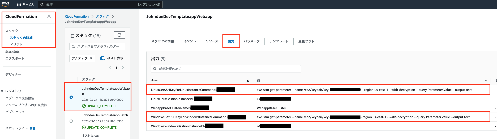
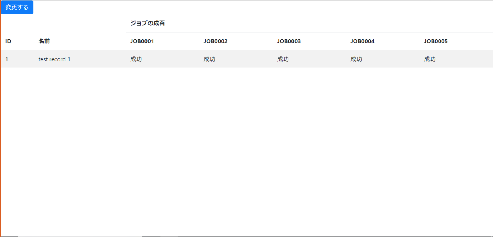
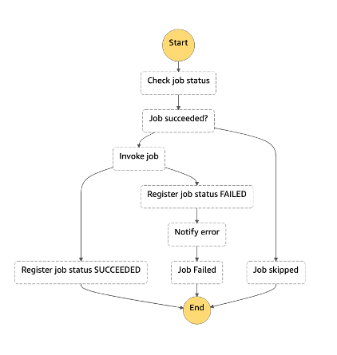

# Java application in closed network

[日本語で読む](./README_ja.md)

## Overview

This project provides CDK code to build an environment for running sample applications and batch systems on AWS.

### Architecture



This architecture consists of the following main components:

1. **Network Layer**
   - Shared VPC (SharedNetworkStack): For Transit Gateway connections
   - Application VPC (NetworkStack): For application runtime environment

2. **Computing Layer**
   - ECS Cluster (WebappStack): Web application runtime environment
   - Bastion host: Windows or Linux instances for management access

3. **Storage Layer**
   - Aurora PostgreSQL (StorageStack): For application data storage
   - S3 buckets: For artifact storage

4. **CI/CD**
   - CodePipeline: CI/CD pipeline with S3 as source
   - CodeBuild: For Docker image building
   - ECR: For container image storage

5. **Batch Processing**
   - Step Functions: For workflow management
   - ECS Tasks: For batch job execution
   - DynamoDB: For job execution state management
   - SNS: For failure notifications

6. **Domain Management**
   - Route 53 Private Hosted Zone: For internal DNS management

This architecture enables you to build a secure and highly available application runtime environment.

## Preparation

### 1. Configuring the AWS CLI

In order to use the CDK and deploy this application it is necessary to configure the `AWS CLI`. On a terminal run the following command:

```bash
$ aws configure --profile {profile name}
```

Run and enter the required information in response to the prompts that appear.

The access key, secret key, and default region that are displayed when an IAM user is created are checked.
For more information, see [Quick Setup with aws configure - Profiles](https://docs.aws.amazon.com/cli/latest/userguide/cli-configure-quickstart.html#cli-configure-quickstart-profiles).

### 2. Configure parameter.ts

This template uses CDK written in TypeScript for deployment.
The parameters required for deployment are defined in `parameter.ts`, so they can be changed according to each environment.

```typescript
const devParameter: Parameter = {
  deployEnv: "dev",
  sharedVpcCidr: '10.0.0.0/16',
  appVpcCidr: '10.1.0.0/16',
  filePathOfSourceArtifact: 'webapp-repository/assets/webapp.zip',
  windowsBastion: false,
  linuxBastion: false,
  domainName: "templateapp.local",
  notifyEmail: "johndoe+notify@example.com"
}
```

Main configuration items:
- `deployEnv`: Specify the environment to deploy (e.g., dev, stage, prod)
- `windowsBastion`: Set to true if you want to use a Windows Bastion instance, false otherwise
- `linuxBastion`: Set to true if you want to use an Amazon Linux Bastion instance, false otherwise
- `domainName`: Domain name to be registered in the Private Hosted Zone
- `notifyEmail`: Email address for notifications when jobs fail

### 3. Create self-signed certificate

Self-signed certificate will be used in this sample to use HTTPS.
Please run this command in the `usecases/webapp-java` directory to import certificate to Amazon Certificate Manager.
Please install `OpenSSL` to your local environment before running these commands.

```bash
$ npm install
$ npm run create:certificate
```

## How to deploy

### 1. CDK

Run the following command in the `usecases/webapp-java` directory:

```bash
$ npm run deploy
```

After deployment, the commands to get keypairs will be shown in the same terminal.
If you want to use SSH from your client or RDP connection via Fleet Manager, please get keypairs by running the displayed commands. (Please specify your AWS profile when running the commands)

```
// For Windows instance in ap-northeast-1 region
$ devWebapp.WindowsGetSSHKeyForWindowsInstanceCommand = aws ssm get-parameter --name /ec2/keypair/key-XXXXXXXXXXXXXXXXX --region ap-northeast-1 --with-decryption --query Parameter.Value --output text

// For Amazon Linux instance in ap-northeast-1 region
$ devWebapp.LinuxGetSSHKeyForLinuxInstanceCommand = aws ssm get-parameter --name /ec2/keypair/key-XXXXXXXXXXXXXXXXX --region ap-northeast-1 --with-decryption --query Parameter.Value --output text
```

> NOTE:
> If you deploy this template for the first time, there are many outputs in your terminal.
> So, you may not find these commands in your terminal.
> In this case, please go to CloudFormation's console in your browser.
> And open the `Output` tab of `Webapp stack`. You can see commands in your screen like below image.
> 

After CDK deployment, the email address you specified in `parameter.ts` will receive a subscription confirmation email from Amazon SNS.

Please confirm the subscription by following the instructions in the email to receive notifications when jobs fail.

The batch job is scheduled to run at 9:00 PM on weekdays. The initial data registered by the sample web application deployment is configured to make all jobs succeed, so no notification will be sent.
If you want to test the failure notification, change any of the five `true` values in `webapp/src/main/resources/data.sql` to `false` before deploying the web application.

### 2. Deploy sample web application

After deploying CDK, an S3 bucket for the sample web application repository is created.

> NOTE:
> The S3 bucket path is displayed in the terminal after deployment or in the CloudFormation console.
> If you're checking the CloudFormation console, refer to the `Output` tab of the `CICD stack`.
> 

Follow these steps to upload the source code from the `webapp` directory to the S3 bucket to deploy the sample web application through the pipeline.

#### Step 1: Create a zip file from the webapp directory

```bash
$ cd ./webapp
$ zip -r webapp.zip .
```

#### Step 2: Upload the zip file to the S3 bucket

**Using AWS CLI:**

```bash
# Check the S3 bucket name (obtained from CloudFormation output)
$ aws s3 cp webapp.zip s3://{bucket-name}/webapp-repository/assets/webapp.zip --profile {profile-name}
```

**Using the Management Console:**

1. Open the S3 service in the AWS Management Console
2. Select the target bucket
3. Navigate to the `webapp-repository/assets/` path (create folders if they don't exist)
4. Upload the file with the name `webapp.zip`

#### Step 3: Check the pipeline

Once the zip file is uploaded, CodePipeline will automatically start.
If you want to check the pipeline status, access AWS CodePipeline via the management console.

#### CI/CD Pipeline

The CI/CD for the web application uses an S3 bucket as the source, builds a Docker image with CodeBuild, pushes it to ECR, and then deploys it to ECS.

If you want to replace it with your own web application, replace the source code uploaded to the S3 bucket with your own and modify the Dockerfile to suit your environment and application.

### 3. Testing

When you want to check the web application, you can access it through the Bastion server on EC2.

To access the Bastion server, use the keypair obtained in [Deploy - 1. CDK](#1-cdk) and connect via Fleet Manager.
For information on how to connect to the Bastion server via Fleet Manager Remote Desktop, please see [Connect to a managed node using Remote Desktop](https://docs.aws.amazon.com/systems-manager/latest/userguide/fleet-rdp.html#fleet-rdp-connect-to-node).

Once connected to the Bastion server, open your browser and enter the domain specified by `domainName` in `parameter.ts` to access the web application.

If the following screen is displayed, it is successful:



### 4. Delete environment

If you want to delete the created environment, execute the following command:

```
$ npm run destroy
```

Some resources like ECR may remain depending on the situation, requiring manual deletion.
Reference: [(ecr): add option to auto delete images upon ECR repository removal #12618](https://github.com/aws/aws-cdk/issues/12618)
If the command fails, check the error message or CloudFormation console to understand what happened and address the root cause.

### Additional commands

Since `diff, list`, which are CDK commands, have already been implemented in npm scripts, these commands can also be executed:

```
$ npm run diff
$ npm run list
```

## Job management feature implemented by Step Functions

A job management platform requires features such as "① Creating workflows", "② Enabling re-execution", and "③ Sending notifications on failure".
While ① can be achieved with Step Functions, ② and ③ require implementation.
This sample provides implementation examples for ② and ③.

The sample implemented here has a parent-child relationship in the Step Functions state machines, with the parent handling the main workflow and the child implementing ② and ③.
For information on how to create workflows in state machines, please refer to the [official documentation](https://docs.aws.amazon.com/step-functions/latest/dg/welcome.html).

Here, we will explain the implementation of ② and ③.
The following figure shows a child state machine called from the parent state machine:



In the child state machine, a job script is executed according to the following flow:

1. Check the execution status of the job script for the current day
2. Determine if the job was successful
   1. If successful, the job is skipped
3. If not successful, run the job script
4. If the job script result is successful, register the execution state as "SUCCEEDED" and end this state machine
5. If the job script result fails, register the execution state as "FAILED"
6. Continue and send a failure notification by email
7. Set the state machine as failed and exit

When checking or registering the state, DynamoDB is accessed, and the job execution state is referenced and registered using the execution date and job ID as keys.
By managing the execution state this way, ② (job re-execution) is made possible.

For ③ (job failure notification), Step Functions executes the SNS API to send the failed job ID, and a notification is sent to the subscribed email address.

## CDK Static Analysis

The CDK code in this project uses [cdk-nag](https://github.com/cdklabs/cdk-nag/blob/main/README.md) for static analysis.
By checking if the implementation follows the provided rules, critical security risks can be prevented.

Exceptions to the rules are listed at the bottom of the source code.
Please add or remove exceptions as needed.

For specific usage, see [Manage application security and compliance with the AWS Cloud Development Kit and cdk-nag](https://aws.amazon.com/blogs/news/manage-application-security-and-compliance-with-the-aws-cloud-development-kit-and-cdk-nag/).

## Security Hub Check Results

When Security Hub is enabled, the following two standards are enabled by default:

- [AWS Foundational Security Best Practices (FSBP) standard](https://docs.aws.amazon.com/securityhub/latest/userguide/fsbp-standard.html)
- [Center for Internet Security (CIS) AWS Foundations Benchmark v1.2.0](https://docs.aws.amazon.com/securityhub/latest/userguide/cis-aws-foundations-benchmark.html)

When these checks are performed, some items may be reported with CRITICAL or HIGH severity in the benchmark report.
These require separate handling.

### Enable MFA for the root user

#### Checks

- [[CIS.1.13] Ensure MFA is enabled for the "root" account](https://docs.aws.amazon.com/securityhub/latest/userguide/securityhub-cis-controls.html#securityhub-cis-controls-1.13)
- [[CIS.1.14] Ensure hardware MFA is enabled for the "root" account](https://docs.aws.amazon.com/securityhub/latest/userguide/securityhub-cis-controls.html#securityhub-cis-controls-1.14)
- [[IAM.6] Hardware MFA should be enabled for the root user](https://docs.aws.amazon.com/securityhub/latest/userguide/securityhub-standards-fsbp-controls.html#fsbp-iam-6)

#### How to fix

- Log in to AWS as the root user and follow the documentation below to enable MFA:
  - [Enable a hardware TOTP token for the AWS account root user (console)](https://docs.aws.amazon.com/IAM/latest/UserGuide/id_credentials_mfa_enable_physical.html#enable-hw-mfa-for-root)

### Disable CodeBuild's privileged mode

#### Checks

- [[CodeBuild.5] CodeBuild project environments should not have privileged mode enabled](https://docs.aws.amazon.com/securityhub/latest/userguide/securityhub-standards-fsbp-controls.html#fsbp-codebuild-5)

#### How to fix

- CodeBuild's privileged mode should be disabled except when Docker image building is required. This template has it enabled because it builds Docker images, but please adjust the setting according to your environment.
  - For template-only fixes, change the [privileged mode setting in the CodePipeline construct](lib/construct/codepipeline/codepipeline-webapp-java.ts#L65) to `false`.
  - Reference: [interface BuildEnvironment - privileged](https://docs.aws.amazon.com/cdk/api/v1/docs/@aws-cdk_aws-codebuild.BuildEnvironment.html#privileged)

## Production Considerations

### Network Access Configuration

#### Application Load Balancer Access Control

By default, the Application Load Balancer (ALB) is configured to accept HTTPS traffic only from the Shared VPC CIDR block. To allow access from your organization's on-premises networks or other CIDR blocks, you need to add additional ingress rules to the ALB security group.

##### Adding Custom CIDR Blocks

To allow access from your organization's IP ranges, modify the `WebappStack` in `lib/webapp-stack.ts`:

```typescript
// Example: Allow access from your organization's CIDR blocks
ecsBase.albSg.addIngressRule(
  aws_ec2.Peer.ipv4('192.168.0.0/16'), 
  aws_ec2.Port.HTTPS, 
  'Allow HTTPS traffic from organization network'
);

// Add multiple CIDR blocks as needed
ecsBase.albSg.addIngressRule(
  aws_ec2.Peer.ipv4('172.16.0.0/12'), 
  aws_ec2.Port.HTTPS, 
  'Allow HTTPS traffic from branch office'
);
```

##### Security Considerations

- Only add CIDR blocks that you trust and control
- Use the most restrictive CIDR ranges possible (avoid 0.0.0.0/0)
- Document each CIDR block with a clear description
- Regularly review and audit the allowed IP ranges

### EC2 Patching

When using EC2 instances for operations management, consider how to apply patches.
While you can manually apply patches via Session Manager, Patch Manager is useful for automatic patching.
For more information, see [AWS Systems Manager Patch Manager](https://docs.aws.amazon.com/systems-manager/latest/userguide/systems-manager-patch.html).

Beyond patch management, AWS has published the [AWS Well-Architected Framework](https://docs.aws.amazon.com/wellarchitected/latest/framework/welcome.html), which compiles best practices based on years of experience. Please refer to it.

### Container Image Tags

In this sample, the batch container image is tagged with "latest".
For the web application container image, versioning is done using build timestamps through the pipeline that starts with uploading to the S3 bucket.
More strict versioning for batch containers can be achieved by implementing a similar pipeline.

### HTTPS Certificates

This sample uses a self-signed certificate for HTTPS communication.
As it's a self-signed certificate, please use it only for testing purposes.
