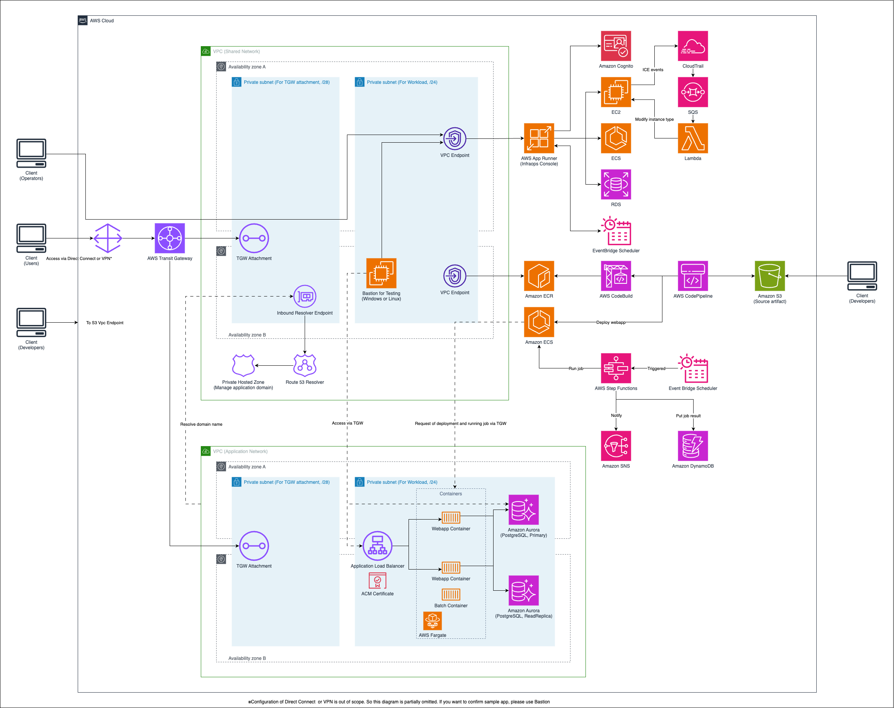
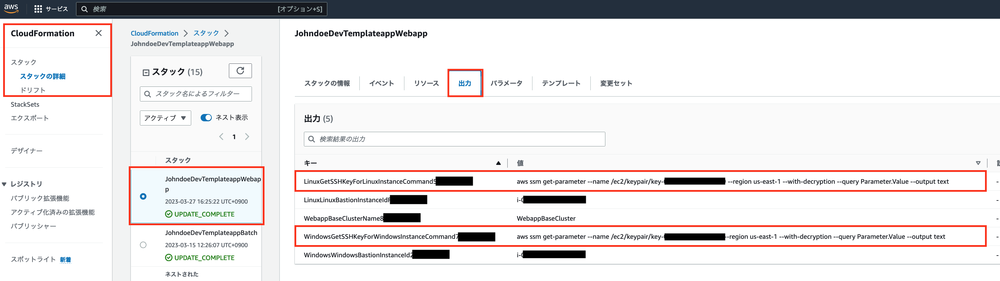
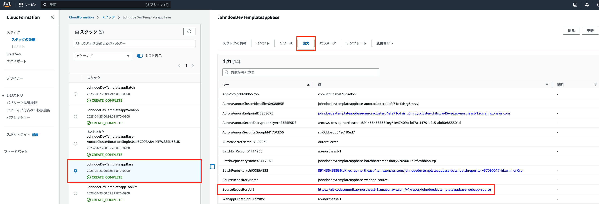
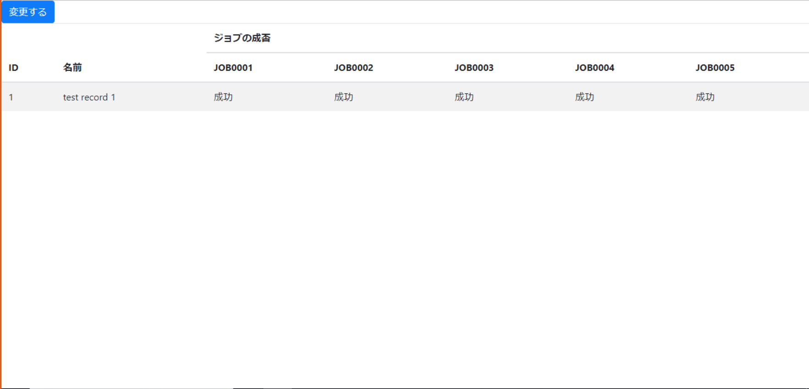
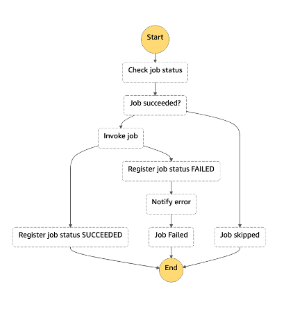

# Java application in closed network

[View this page in English](./README.md)

## 概要

このプロジェクトは、AWS上にサンプルアプリケーションやバッチシステムを動かす環境を構築するためのCDKコードを提供します。

### アーキテクチャ



このアーキテクチャは以下の主要コンポーネントで構成されています：

1. **ネットワーク層**
   - 共有VPC（SharedNetworkStack）：Transit Gateway接続用
   - アプリケーションVPC（NetworkStack）：アプリケーション実行環境用

2. **コンピューティング層**
   - ECSクラスター（WebappStack）：Webアプリケーションの実行環境
   - Bastionホスト：WindowsまたはLinuxインスタンスによる管理アクセス用

3. **ストレージ層**
   - Aurora PostgreSQL（StorageStack）：アプリケーションデータ保存用
   - S3バケット：アーティファクト保存用

4. **CI/CD**
   - CodePipeline：S3をソースとしたCI/CDパイプライン
   - CodeBuild：Dockerイメージのビルド
   - ECR：コンテナイメージの保存

5. **バッチ処理**
   - Step Functions：ワークフロー管理
   - ECS Tasks：バッチジョブの実行
   - DynamoDB：ジョブ実行状態の管理
   - SNS：失敗通知

6. **ドメイン管理**
   - Route 53 Private Hosted Zone：内部DNS管理

## 準備

### 1. AWS CLI の設定

CDK を利用するため、コマンドを実行する端末で AWS の設定が必要になります。

```bash
$ aws configure --profile {プロファイル名}
```

と実行し、表示されるプロンプトに応じて、必要な情報を入力してください。

アクセスキーとシークレットキー、デフォルトのリージョンが確認されます。
詳しくは[aws configure を使用したクイック設定 - プロファイル](https://docs.aws.amazon.com/ja_jp/cli/latest/userguide/cli-configure-quickstart.html#cli-configure-quickstart-profiles)をご参照ください。

### 2. parameter.ts の設定

本テンプレートは、TypeScriptで記述されたCDKを利用してデプロイを行います。
デプロイに必要なパラメータが`parameter.ts`で定義されているため、各自の環境に合わせて変更します。

```typescript
const devParameter: Parameter = {
  deployEnv: "dev",
  sharedVpcCidr: '10.0.0.0/16',
  appVpcCidr: '10.1.0.0/16',
  filePathOfSourceArtifact: 'webapp-repository/assets/webapp.zip',
  windowsBastion: false,
  linuxBastion: false,
  domainName: "templateapp.local",
  notifyEmail: "johndoe+notify@example.com"
}
```

主な設定項目：
- `deployEnv`: デプロイする環境の面を記載します（例: dev, stage, prod など）
- `windowsBastion`: WindowsのBastionインスタンスを利用する場合はtrue、利用しない場合はfalse
- `linuxBastion`: Amazon LinuxのBastionインスタンスを利用する場合はtrue、利用しない場合はfalse
- `domainName`: Private Hosted Zoneに登録されるドメイン名
- `notifyEmail`: ジョブが失敗した際の通知先メールアドレス

### 3. 自己署名付き証明書の作成

HTTPS 通信を実装するために、今回は自己署名付き証明書を用います。
`usecases/webapp-java`ディレクトリで次のコマンドを実行し、Amazon Certificate Manager に証明書をインポートしてください。
また、以下のコマンド実行前に、`OpenSSL`のインストールを実施してください。

```bash
$ npm install
$ npm run create:certificate
```

## デプロイ

### 1. CDK

`usecases/webapp-java`ディレクトリで以下のコマンドを実行してください。
自動的に CDK が実行され、AWS の各リソースが生成されます。

```bash
$ npm run deploy
```

デプロイ後、ターミナル上に以下に示すようなコマンドが出力されますので、コピーして実行してください。
生成された EC2 インスタンス 用の Keypair がそれぞれ取得できます。
コンソール接続する場合や Fleet Manager から RDP 接続する際には、Keypair の取得を行ってください。（コマンド実行時には Profile の指定をお願いします）

```
// regionがap-northeast-1のWindowsインスタンスの場合
$ devWebapp.WindowsGetSSHKeyForWindowsInstanceCommand = aws ssm get-parameter --name /ec2/keypair/key-XXXXXXXXXXXXXXXXX --region ap-northeast-1 --with-decryption --query Parameter.Value --output text

// regionがap-northeast-1のAmazonLinuxインスタンスの場合
$ devWebapp.LinuxGetSSHKeyForLinuxInstanceCommand = aws ssm get-parameter --name /ec2/keypair/key-XXXXXXXXXXXXXXXXX --region ap-northeast-1 --with-decryption --query Parameter.Value --output text
```

> NOTE:
> 初回デプロイ時は、ターミナルの出力が多いため、Keypair を取得するためのコマンドが見えなくなってしまうことがあります。
> その場合は、ブラウザから CloudFormation のコンソールを開き、Webapp スタックの出力タブからご確認ください。
> 

また、CDK のデプロイが完了すると、`parameter.ts` に登録したメールアドレス宛に、Amazon SNS よりサブスクリプションの確認メールが届きます。

ジョブが失敗した通知を受けるために、届いたメールの内容に従い、サブスクリプションの Confirmation を実施してください。

また、バッチジョブは平日 21 時に実行される設定になっています。このあと実施する、サンプル Web アプリのデプロイによって登録される初期データは、ジョブがすべて成功する設定になっているため、メールは送信されません。
もし、失敗を確認したい場合は、`webapp/src/main/resources/data.sql`の 5 つある`true`のいずれかを`false`へ変更した上で、Web アプリのデプロイを行ってください。

### 2. サンプル Web アプリ

CDK のデプロイが完了したことで、S3バケットにサンプル Web アプリ用のリポジトリが作成されています。

> NOTE:
> S3バケットのパスはデプロイをしたターミナルもしくは、CloudFormation のコンソールに表示されます。
> CloudFormation のコンソールを参照する場合は、`CICDスタック`の`出力`タブを参照ください。
> 

以下の手順で、`webapp` ディレクトリのソースコードをS3バケットにアップロードすることで、サンプル Web アプリがパイプラインからデプロイされます。

#### 手順1: webappディレクトリをzipファイルに圧縮

```bash
$ cd ./webapp
$ zip -r webapp.zip .
```

#### 手順2: S3バケットにzipファイルをアップロード

**AWS CLIを使用する場合:**

```bash
# S3バケット名を確認（CloudFormationの出力から取得）
$ aws s3 cp webapp.zip s3://{バケット名}/webapp-repository/assets/webapp.zip --profile {プロファイル名}
```

**マネジメントコンソールを使用する場合:**

1. AWS マネジメントコンソールでS3サービスを開く
2. 対象のバケットを選択
3. `webapp-repository/assets/` パスに移動（フォルダが存在しない場合は作成）
4. `webapp.zip` という名前でファイルをアップロード

#### 手順3: パイプラインの確認

zipファイルがアップロードされると、自動的にCodePipelineが開始されます。
パイプラインの状況を確認したい場合は、マネジメントコンソールより AWS CodePipeline へアクセスしてください。

#### CI/CD パイプラインについて

Web アプリ向けの CI/CD は S3バケットをソースとして、CodeBuildでDockerイメージをビルドし、ECRにプッシュ、そしてECSにデプロイする流れになっています。

ご自身の Web アプリケーションに差し替えたい場合は、S3バケットにアップロードするソースコードをご自身のものに差し替え、ご自身の環境やアプリケーションに合わせ、Dockerfile を修正してください。

### ３. 動作確認

デプロイした Web アプリの動作を確認したい場合、Bastion として構築した Windows が起動している EC2 上でブラウザを起動し、アプリケーションにアクセスします。

Bastion にアクセスする Keypair は[デプロイ - 1. CDK](#1-cdk)で取得したものを利用し、Fleet Manager 経由でアクセスします。
Fleet Manager を利用した RDP 接続の方法は、[リモートデスクトップを使用してマネージドノードへ接続する](https://docs.aws.amazon.com/ja_jp/systems-manager/latest/userguide/fleet-rdp.html#fleet-rdp-connect-to-node)を参照ください。

Bastion への RDP 接続ができたら、ブラウザを起動し、`parameter.ts`の`domainName`で指定したドメインを入力し、アプリケーションにアクセスしてください。

次のような画面が表示されたら成功です。



### 4. 作成した環境の削除

生成した環境を削除したい場合は、以下のコマンドを実行してください。
ECR など、状況によっては残ってしまうリソースもあるため、手動での削除が必要な場合があります。
ご参考：[(ecr): add option to auto delete images upon ECR repository removal #12618 ](https://github.com/aws/aws-cdk/issues/12618)
コマンドが失敗した場合は、エラーメッセージや CloudFormation のコンソールで内容をご確認の上、対応ください。

```
$ npm run destroy
```

### その他のコマンド

CDK のコマンドである、`diff, list`は、npm scriptsで実装済みのため、これらのコマンドも実行可能です。

```
$ npm run diff
$ npm run list
```

## AWS Step Functions で実装するジョブ管理基盤

ジョブ管理基盤は、「① ワークフローが作成できること」「② 再実行が可能なこと」「③ 失敗時に通知が出せること」といった機能が求められます。
① のワークフローについては、Step Functions で実現可能ですが、② や ③ は実装が必要になります。
本サンプルでは、この ②、③ の実装例をご提供します。

今回実装したサンプルは、Step Functions のステートマシンが親子関係になっており、親側がメインのワークフロー、子側で ② と ③ を実現しています。
ステートマシンにおけるワークフローの作成方法については、[公式のドキュメント](https://docs.aws.amazon.com/ja_jp/step-functions/latest/dg/welcome.html)をご参照ください。

ここでは、実装している ②、③ について解説します。
以下の図は、親のステートマシンから呼び出される、子のステートマシンを示しています。



子のステートマシンでは、ある一つのジョブスクリプトが実行されますが、以下の流れに沿って実行されます。

1. ジョブスクリプトの当日の実行状態を確認する
2. ジョブが成功しているか判定する
   1. 成功していれば、ジョブはスキップされます
3. 成功以外であれば、ジョブスクリプトを実行する
4. ジョブスクリプトの結果が成功なら、実行状態を"SUCCEEDED"として登録し、このステートマシンを終了する
5. ジョブスクリプトの結果が失敗なら、実行状態を"FAILED"として登録する
6. 続けて、失敗したことをメールで通知する
7. ステートマシンとして失敗したことを設定し、終了する

状態の確認や状態の登録時に、DynamoDB にアクセスし、ジョブの実行状態が、実行日付とジョブの ID をキーとして、参照・登録されます。
このような実行状態の管理を行うことで、② のジョブの再実行を可能にしています。

③ のジョブの失敗通知は、Step Functions が SNS の API を実行することで、失敗したジョブ ID を連携し、購読されているメールアドレスに通知が送信されます。

## CDK の静的解析

本プロジェクトの CDK のコードは、[cdk-nag](https://github.com/cdklabs/cdk-nag/blob/main/README.md)を利用して静的解析を実施しています。
提供されているルールに沿った実装ができているか確認することで、致命的なセキュリティリスクを予防します。

例外化しているルールは、ソースコードの下部にまとめて記載しています。
必要に応じて例外化の追加・削除を実施ください。

具体的な使い方については、[AWS Cloud Development Kit と cdk-nag でアプリケーションのセキュリティとコンプライアンスを管理する](https://aws.amazon.com/jp/blogs/news/manage-application-security-and-compliance-with-the-aws-cloud-development-kit-and-cdk-nag/)、にて解説していますので、ご参照ください。

## Security Hub のチェック結果

Security Hub を有効にした場合、デフォルトで有効になる基準は以下の 2 つです。

- [AWS Foundational Security Best Practices (FSBP) standard](https://docs.aws.amazon.com/ja_jp/securityhub/latest/userguide/fsbp-standard.html)
- [Center for Internet Security (CIS) AWS Foundations Benchmark v1.2.0](https://docs.aws.amazon.com/ja_jp/securityhub/latest/userguide/cis-aws-foundations-benchmark.html)

これらのチェックが行われると、ベンチマークレポートで重要度が CRITICAL あるいは HIGH のレベルでレポートされる検出項目があります。
これらに対しては、別途対応が必要になります。

### ルートユーザへの MFA の適用

#### 検出項目

- [[CIS.1.13] Ensure MFA is enabled for the "root" account](https://docs.aws.amazon.com/securityhub/latest/userguide/securityhub-cis-controls.html#securityhub-cis-controls-1.13)
- [[CIS.1.14] Ensure hardware MFA is enabled for the "root" account](https://docs.aws.amazon.com/securityhub/latest/userguide/securityhub-cis-controls.html#securityhub-cis-controls-1.14)
- [[IAM.6] Hardware MFA should be enabled for the root user](https://docs.aws.amazon.com/securityhub/latest/userguide/securityhub-standards-fsbp-controls.html#fsbp-iam-6)

#### 修復方法

- ルートユーザで AWS にログインし、以下のドキュメントに沿って MFA を有効化してください。
  - [AWS アカウント のルートユーザー (コンソール) 用にハードウェア TOTP トークンを有効にします](https://docs.aws.amazon.com/IAM/latest/UserGuide/id_credentials_mfa_enable_physical.html#enable-hw-mfa-for-root)

### CodeBuild の特権モードの無効化

#### 検出項目

- [[CodeBuild.5] CodeBuild project environments should not have privileged mode enabled](https://docs.aws.amazon.com/securityhub/latest/userguide/securityhub-standards-fsbp-controls.html#fsbp-codebuild-5)

#### 修復方法

- CodeBuild では、Docker イメージをビルドする必要がある場合を除き、特権モードは無効化してください。本テンプレートでは、Docker イメージのビルドを行っているため、有効化していますが、実際に利用される場合は、ご自身の環境に合った設定にご変更ください。
  - テンプレートだけの対応であれば、[CodePipeline のコンストラクト内の特権モードの設定](lib/construct/codepipeline/codepipeline-webapp-java.ts#L65)を`false`に変更してください。
  - ご参考：[interface BuildEnvironment - privileged](https://docs.aws.amazon.com/cdk/api/v1/docs/@aws-cdk_aws-codebuild.BuildEnvironment.html#privileged)

## 本番利用時の考慮点

### ネットワークアクセス設定

#### Application Load Balancer のアクセス制御

デフォルトでは、Application Load Balancer（ALB）は共有VPCのCIDRブロックからのHTTPS通信のみを受け入れるように設定されています。お客様の拠点ネットワークや他のCIDRブロックからのアクセスを許可するには、ALBのセキュリティグループに追加のインバウンドルールを追加する必要があります。

##### カスタムCIDRブロックの追加

お客様の組織のIPレンジからのアクセスを許可するには、`lib/webapp-stack.ts`の`WebappStack`を修正してください：

```typescript
// 例：お客様の組織のCIDRブロックからのアクセスを許可
ecsBase.albSg.addIngressRule(
  aws_ec2.Peer.ipv4('192.168.0.0/16'), 
  aws_ec2.Port.HTTPS, 
  'Allow HTTPS traffic from organization network'
);

// 必要に応じて複数のCIDRブロックを追加
ecsBase.albSg.addIngressRule(
  aws_ec2.Peer.ipv4('172.16.0.0/12'), 
  aws_ec2.Port.HTTPS, 
  'Allow HTTPS traffic from branch office'
);
```

##### セキュリティ上の考慮事項

- 信頼でき、管理下にあるCIDRブロックのみを追加してください
- 可能な限り制限的なCIDRレンジを使用してください（0.0.0.0/0は避ける）
- 各CIDRブロックには明確な説明を記載してください
- 許可されたIPレンジを定期的に確認・監査してください

### EC2 へのパッチ適用について

運用管理のため EC2 インスタンスを利用する場合、パッチを当てる方法についてもご検討ください。
Session Manager を経由して手動でパッチを当てることも可能ですが、自動でパッチを当てるには、Patch Manager が有用です。
詳しくは、[AWS Systems Manager Patch Manager](https://docs.aws.amazon.com/ja_jp/systems-manager/latest/userguide/systems-manager-patch.html)をご参照ください。

また、パッチ適用といった変更管理における考え方に限らず、AWS では長年培った経験をもとにベストプラクティスをフレームワークとしてまとめた、[AWS Well-Architected Framework](https://docs.aws.amazon.com/ja_jp/wellarchitected/latest/framework/welcome.html)を公開しています。ぜひご参照ください。

### コンテナイメージのタグについて

本サンプルでは、バッチのコンテナイメージのタグに latest が付与されています。
Web アプリのコンテナイメージに対しては、S3バケットへのアップロードから始まるパイプラインによって、ビルド時のタイムスタンプを利用したバージョンニングを実施します。
バッチでも同様のパイプラインを導入することで、より厳格なバージョニングが可能です。

### HTTPS の証明書について

本サンプルでは、自己署名付き証明書を利用して HTTPS を用いた通信を行なっています。
自己署名付き証明書のため、あくまで検証用としてご利用ください。
