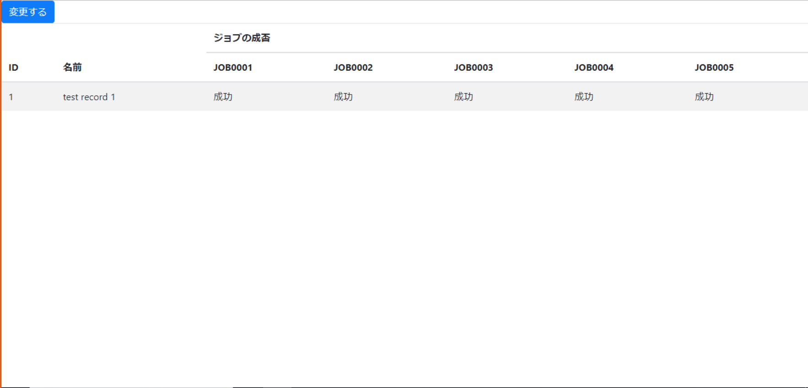

# webapp-java

[View this page in English](./README.md)

## 概要

本アプリケーションは、infra 上で Java アプリケーションの動作確認を行うためのサンプルアプリケーションになります。
また、アプリケーション内で DB を操作することができ、バッチ処理で失敗させるレコードを選択することで、バッチ処理の動作確認を行うことができます。

## ローカルでの動作確認

### ローカルに DB を構築する

実行させたい環境に、PostgreSQL をインストール、もしくは Docker にて起動させてください。
その際に、DB にアクセスするユーザ名とパスワードは控えておいてください。

### 環境変数の設定

3 つの環境変数を定義してください。DB の構築時に控えておいた、ユーザ名とパスワードを設定してください。

```sh
$ export $DB_ENDPOINT=localhost
$ export $DB_USERNAME={構築時に設定したユーザ名}
$ export $DB_PASSWORD={構築時に設定したパスワード}
```

### テーブルの初期化とサンプルデータの追加

`src/resources/application.properties` に設定されている、`spring.sql.init.mode=always`によって、起動時に必ず`src/main/resources/data.sql`と`src/main/resources/schema.sql`が呼び出され、DB が初期化されます。
本アプリケーションはサンプルのため、このような設定をしていますが、本番利用の際には DB の初期化やマイグレーションの実施方法について別途ご検討ください。

### 実行

次のコマンドを実行すると、localhost:8080 にアクセスして、アプリケーションの動作が確認できます。

```sh
./gradlew bootRun
```

### スクリーンショット

次の画像のような画面が表示されたら起動しています。



## ビルド

次のコマンドを実行すると、`build/libs`に jar ファイルが生成されます。

```sh
./gradlew build
```
