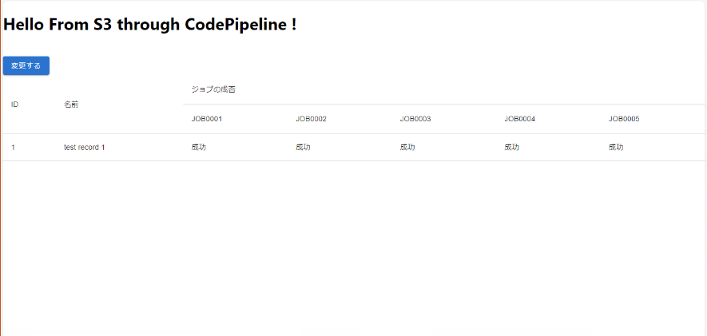

# webapp-react

## 概要

本アプリケーションは、サーバーレスな infra 上で React アプリケーションの動作確認を行うためのサンプルアプリケーションになります。
また、アプリケーション内で DB を操作することができ、バッチ処理で失敗させるレコードを選択することで、バッチ処理の動作確認を行うことができます。

## スクリーンショット

次の画像のような画面が表示されたら起動しています。

